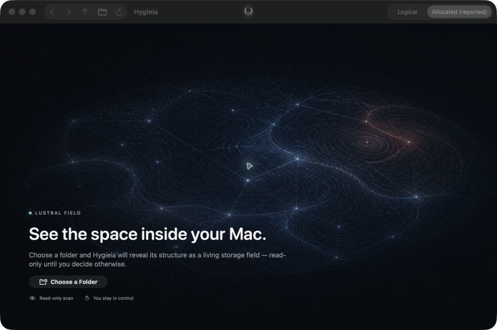
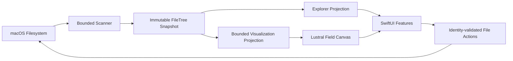

<div align="center">

# Hygieia

**A native macOS disk-space explorer for seeing what fills your Mac and taking
careful action without losing filesystem context.**

[](docs/ROADMAP.md)
[](Package.swift)
[](Package.swift)
[](LICENSE)

</div>



The screenshots in this README show the real native interface with no personal
files or paths. Hygieia scans a folder selected through the macOS system picker,
builds a compact in-memory snapshot, and turns it into a bounded **Lustral
Field**: a spatial view of where disk space is going.

> [!IMPORTANT]
> Hygieia `0.2.0` is an early source preview for Apple Silicon Macs. Core,
> scanner, app, visualization, and identity-validated file-action code are
> present, but signed sandbox, Finder/Trash, VoiceOver, Full Disk Access,
> performance, packaging, and notarization gates are not complete. There is no
> downloadable production release yet.

## Why Hygieia

- **The map stays bounded.** The renderer receives a capped projection rather
  than one SwiftUI object per filesystem item.
- **The tree remains the truth.** List, chart, details, navigation, and actions
  are projections of the same immutable `FileTree` snapshot.
- **Filesystem uncertainty stays visible.** Permission failures, incomplete
  subtrees, volume boundaries, hard-link accounting, and stale results are not
  silently presented as complete knowledge.
- **Cleanup is deliberately hard to trigger.** Hygieia has no permanent-delete
  operation. Trash targets are checked against snapshot identity immediately
  before the system request, and a successful action requires a full-root
  rescan.
- **It is native by design.** SwiftUI, focused AppKit integration, Swift
  Concurrency, Foundation, and Darwin APIs keep the app close to macOS.

## Product tour

### Choose the scope you actually mean

Start from a local disk or narrow the scan to one folder through the macOS
system picker. The selected root is explicit, symbolic links are never
traversed, and volume boundaries are not crossed by assumption.

### Follow a scan without a false percentage

Hygieia reports discovered items, folders, reported bytes, elapsed time, and an
approximate ETA only when the queue provides enough evidence. Cancellation
returns a valid partial result instead of pretending the scan completed. Live
scan captures are intentionally excluded from the public repository unless they
come from a fully synthetic runtime fixture.

### Explore one snapshot, not the filesystem again

The Sunburst field, largest-items rail, breadcrumbs, details, Back/Forward/Up,
and drill-down navigation all work from the completed snapshot. Changing the
visible root or size metric does not launch another scan.

### Review before cleanup

Eligible items can be inspected in Finder, marked for a bounded review list,
and moved to the system Trash after explicit confirmation. Root, ancestor, and
leaf identities are revalidated without following symlinks. Nothing in Hygieia
empties the Trash or permanently deletes a file.

## Current capabilities

### Scanner and accounting

- bounded concurrent scanning with coarse progress and cancellation;
- compact, contiguous `FileTree` storage with UTF-8 name storage;
- logical and reported allocated size modes;
- no-follow symbolic-link handling and explicit volume boundaries;
- regular-file hard links represented by every name but accounted once;
- recoverable permission and disappearing-item issues in the result.

`allocatedSize` is reported `st_blocks × 512`, not guaranteed reclaimable
space. Directory and symbolic-link allocation is excluded, and APFS shared
blocks are not deduplicated.

### Native explorer

- sandboxed SwiftUI app shell with local-volume discovery and system folder
  selection;
- bounded Largest Items list and Canvas-based Sunburst visualization;
- synchronized selection, details, hover, metric switching, drill-down, and
  navigation history;
- dark-first Lustral Field hierarchy, Reduce Motion behavior, and a bounded
  accessibility representation.

### File actions

- Show in Finder through a platform adapter;
- one-item and marked-list Move to Trash workflows;
- typed eligibility denials for root, visible root, virtual, stale, partial,
  incomplete, or identity-unknown targets;
- no-follow identity-chain validation for root, ancestors, and leaf;
- explicit stale state followed by a complete selected-root rescan after a
  successful action.

The path-based macOS Trash API still leaves a short time-of-check/time-of-use
window after validation. This residual risk and all open manual gates are
documented in the [M4 contract](docs/M4_FILE_ACTIONS.md).

## Run the macOS app

Requirements: an Apple Silicon Mac, macOS 14 or newer, and a current Xcode with
Swift 6 support.

1. Clone the repository.
2. Open `Hygieia.xcodeproj` in Xcode.
3. Select the shared `Hygieia` scheme and **My Mac** destination.
4. Build and run.

The project currently uses development signing and App Sandbox. It is not yet a
packaged, signed, or notarized distribution.

## CLI and verification

The scanner can be exercised without the app:

```bash
swift run hygieia scan /path/to/directory --top 20
swift run -c release hygieia benchmark /path/to/directory --workers 4
swift run hygieia-verify
```

Run the pure Swift package tests with:

```bash
swift test
```

Run the app test plan from Xcode, or from a full Xcode command-line environment:

```bash
xcodebuild \
  -project Hygieia.xcodeproj \
  -scheme Hygieia \
  -destination 'platform=macOS,arch=arm64' \
  test
```

## Architecture



- `Domain` owns compact value types and `FileTree` semantics.
- `Scanner` enumerates filesystem metadata and never depends on the UI.
- `Visualization` projects, lays out, and hit-tests a bounded Sunburst model.
- `FileOperations` owns eligibility and no-follow target validation.
- `Features` and `App` compose native presentation and macOS adapters.
- `Persistence` and `Monitoring` are reserved for later milestones.

Read the [architecture overview](docs/ARCHITECTURE.md) and
[ADR registry](docs/adr/README.md) before changing cross-boundary behavior.

## Status and roadmap

Hygieia follows evidence-based milestones rather than calendar promises. M1
scanner/Core, M2 app shell, M3 Sunburst, and M4 file-action implementations are
present in source, while their named manual, accessibility, filesystem, and
performance gates remain open. M5a provides a partial local-volume entry flow;
Whole Mac orchestration and Full Disk Access coverage are not implemented.

- [Engineering roadmap](docs/ROADMAP.md)
- [M1 Scanner Core](docs/M1_SCANNER_CORE.md)
- [M2 Basic macOS App](docs/M2_BASIC_MACOS_APP.md)
- [M3 Sunburst MVP](docs/M3_SUNBURST_MVP.md)
- [M4 File Actions](docs/M4_FILE_ACTIONS.md)
- [Visualization benchmark harness](docs/M3_BENCHMARKS.md)

## Design and documentation

- [Lustral Field design system](docs/DESIGN_SYSTEM.md)
- [UX and behavior](docs/DESIGN.md)
- [UI change checklist](docs/UI_CHANGE_CHECKLIST.md)
- [Design QA](design-qa.md)
- [README screenshot provenance](docs/assets/readme/README.md)
- [Security policy](SECURITY.md)

## Contributing

Issues and focused pull requests are welcome when they align with the current
milestone and preserve the safety, architecture, and measurement contracts.
There is no guaranteed response or review schedule.

Read [CONTRIBUTING.md](CONTRIBUTING.md) before starting implementation. Do not
include private paths, filesystem listings, credentials, or destructive test
fixtures in an issue.

## License

Copyright holders license Hygieia under the
[GNU Affero General Public License v3.0 or later](LICENSE), SPDX identifier
`AGPL-3.0-or-later`.
