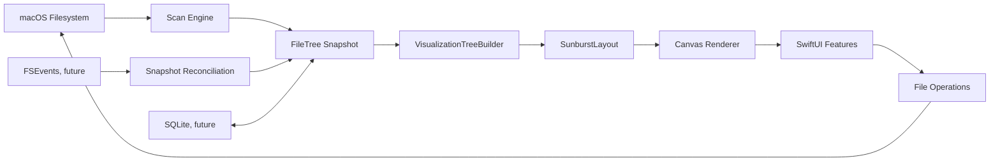

# Архитектура Hygieia

Статус: исходная архитектурная гипотеза для M0. Существенные отклонения оформляются ADR.

## 1. Цели архитектуры

Hygieia должна нативно и предсказуемо анализировать файловое пространство macOS, не связывая корректность модели с конкретным scanner backend или представлением UI. Архитектура оптимизируется вокруг четырёх свойств:

1. компактное хранение нескольких миллионов узлов;
2. корректная, отменяемая и bounded обработка filesystem;
3. независимая проекция большого дерева в ограниченное число видимых элементов;
4. безопасная macOS-интеграция для Finder, корзины и разрешений.

`FileTree` является основным источником истины для результатов одного scan snapshot. Полный путь, layout Sunburst и UI selection — производные данные.

## 2. Non-goals

На текущем фундаментальном этапе не проектируются и не реализуются:

- кроссплатформенность ценой ослабления macOS-интеграции;
- server/backend, cloud sync, telemetry или analytics;
- permanent delete;
- SQLite index и FSEvents implementation;
- оптимизированный `getattrlistbulk()` scanner;
- универсальный DI framework, Redux/TCA/VIPER или абстракции без ближайшего use case;
- точный учёт физически разделяемых APFS blocks без подтверждённой системной возможности;
- отображение каждого узла большого дерева отдельным Sunburst-сектором.

## 3. Технологический стек

- Swift 6.x и строгая concurrency-проверка;
- SwiftUI как основной UI shell;
- AppKit точечно: panels, Finder/workspace integration и macOS behavior, которое SwiftUI не покрывает достаточно хорошо;
- Swift Concurrency для orchestration, cancellation и изоляции изменяемого состояния;
- Foundation для первого scanner backend и platform services;
- Darwin APIs для будущего high-throughput backend на `getattrlistbulk()`;
- SwiftUI `Canvas` для собственного Sunburst renderer;
- FSEvents и SQLite — только в поздних milestones после стабилизации snapshot semantics.

Swift Charts не используется как основа Sunburst. Electron, Tauri, React Native, Flutter, Rust/C++ backend и сторонние UI frameworks не входят в исходную архитектуру. Если измерения покажут необходимость изменения стека, это отдельный ADR, а не скрытая замена.

## 4. High-level architecture



Основные области репозитория:

- `Domain`: стабильные value types, `FileTree` и общие semantics; без SwiftUI/AppKit.
- `Scanner`: scan contracts, coordinator и backend implementations.
- `Visualization`: проекция, layout, hit testing и renderer contracts.
- `FileOperations`: Finder и Trash services, независимо от UI и scanner.
- `Features`: presentation state и SwiftUI screens по пользовательским сценариям; `Features/DesignSystem` содержит только application-level tokens/components из [`DESIGN_SYSTEM.md`](DESIGN_SYSTEM.md).
- `Monitoring`: будущий FSEvents ingestion.
- `Persistence`: будущий snapshot/index store.
- `App`: composition root и lifecycle приложения.

M2 app shell и target/access/state contracts зафиксированы в [`M2_BASIC_MACOS_APP.md`](M2_BASIC_MACOS_APP.md) и ADR-0003. Xcode app target links существующие local SwiftPM products; Domain/Scanner sources не получают duplicate target membership. Точный M3 visualization contract зафиксирован в [`M3_SUNBURST_MVP.md`](M3_SUNBURST_MVP.md) и ADR-0004; M4 identity-validated actions — в [`M4_FILE_ACTIONS.md`](M4_FILE_ACTIONS.md) и ADR-0005.

## 5. Data flow и владение состоянием

```text
filesystem entries
    -> backend batches + progress/issues
    -> ScanCoordinator (единственный writer во время scan)
    -> immutable FileTree snapshot / version
    -> presentation projections
    -> UI
```

Scanner backend перечисляет и читает metadata. `ScanCoordinator` ограничивает параллелизм, нормализует события и строит дерево. UI получает coarse-grained progress и версии доступного результата, но не события на каждый файл. После завершения snapshot считается неизменяемым; действия над файлами порождают контролируемое обновление/invalidations, а не неявную мутацию из view.

M1 публикует coalesced progress и один complete/cancelled `ScanResult`; cancelled result содержит валидный partial `FileTree`. Live immutable tree checkpoints отложены до M2, чтобы не копировать append-only storage через COW и не выдавать mutable builder. Backend directory results применяются к builder порциями с backpressure.

## 6. Domain

Domain описывает идентичность узлов внутри snapshot, компактные metadata, дерево, размеры и политики, общие для scanner и visualization. Domain не знает о:

- SwiftUI views, colors, gestures или `ObservableObject`;
- AppKit services;
- способе перечисления каталогов;
- SQLite schema;
- Canvas geometry.

`NodeID` стабилен только внутри конкретного `FileTree`/snapshot version. Он не является persistent filesystem identity и не должен переживать rescan без reconciliation.

## 7. FileTree model

Наивная graph-модель из миллионов `class FileNode` с массивом children запрещена. Исходная модель — flat contiguous storage:

```text
FileTree
├── nodes: contiguous [FileNode] (40-byte arm64 stride target)
├── names: NameStore (UTF-8 bytes + compact entries)
└── identities: NodeIdentityStore (M4 sidecar)

FileNode
├── logicalSize: UInt64
├── allocatedSize: UInt64
├── parent: NodeID / invalid for root
├── firstChild: NodeID / invalid
├── nextSibling: NodeID / invalid
├── name: NameID
├── kind: NodeKind
└── flags: NodeFlags
```

Sparse hard-link groups хранятся отдельно и не расширяют каждый node. Подробный exact layout, size semantics и capacity limits зафиксированы в [`M1_SCANNER_CORE.md`](M1_SCANNER_CORE.md) и ADR-0002.

M4 добавляет identity sidecar, не меняя 40-byte `FileNode`: inode `UInt64` на node, known bitmap, один primary device и редкие sorted device overrides. Он позволяет проверить root/ancestor/leaf перед filesystem action; это snapshot-local evidence, не persistent identity. Exact contracts и memory gates находятся в [`M4_FILE_ACTIONS.md`](M4_FILE_ACTIONS.md) и ADR-0005.

`NodeID` первоначально использует `UInt32`: этого достаточно для практически достижимого snapshot, снижает размер ссылок и позволяет зарезервировать sentinel. Лимит проверяется при построении и не должен приводить к silent overflow. Если реальные datasets потребуют иной ширины, изменение оформляется ADR с memory benchmark.

Полный абсолютный путь не хранится в node. Он восстанавливается только по запросу, проходом по parent chain от узла к root. Допустим bounded/cache-on-demand для выбранных UI-узлов, но не path cache на всё дерево.

Имена хранятся отдельно. Текущий `NameStore` задаёт направление «UTF-8 slab + descriptors»; interning одинаковых имён является опциональной оптимизацией только после измерений, так как hash table может стоить дороже сохранённых bytes.

Инварианты builder-а:

- ровно один root;
- все ссылки либо valid ID, либо явный sentinel;
- parent/child/sibling relationships непротиворечивы;
- subtree totals вычисляются после обхода снизу вверх или безопасно агрегируются coordinator-ом;
- arithmetic размеров проверяется на overflow и имеет зафиксированную policy;
- virtual visualization nodes никогда не записываются в `FileTree`.

Разделение build-time mutable storage и published immutable snapshot будет уточнено в M1. Публичному UI не выдаётся mutable builder.

## 8. Scan Engine

```text
FileSystemScanner protocol
├── FoundationScanner      (первый корректный backend)
└── DarwinBulkScanner      (будущий getattrlistbulk backend)

ScanCoordinator
├── cancellation ownership
├── bounded directory queue / worker pool
├── FileTree builder ownership
├── progress coalescing
└── issue collection
```

Backend не зависит от SwiftUI и не принимает presentation callbacks. Контракт должен представлять batched discoveries, progress, recoverable access issues и terminal result/error. Замена Foundation на Darwin не меняет Domain или UI.

Обязательные политики scanner-а должны быть явными:

- следовать ли symbolic links (безопасный default: нет);
- пересекать ли mounted volume boundaries;
- рассматривать package/bundle как leaf или directory;
- какую size metric собирать и показывать;
- как обрабатывать permission denied и исчезнувшие во время scan entries;
- как распознавать hard-link identity и предотвращать double counting.

M1 начинает с Foundation shallow-directory implementation одной выбранной директории и честно помечает неподдержанные semantics. Backend не назначает `NodeID`; единственный coordinator-owned builder делает это при commit. Packages всегда traversed и только помечаются как packages; collapse — задача projection. Symlinks записываются и никогда не traversed. `DarwinBulkScanner` до M6 остаётся именованной точкой расширения, не пустой псевдо-реализацией.

## 9. Concurrency model

Нельзя создавать `Task` на каждый файл или каталог. Предполагаемая модель:

1. coordinator владеет directory scan-state/cursor поверх append-only nodes, без растущей очереди materialized URL;
2. фиксированное/настраиваемое малое число долгоживущих workers извлекает задания;
3. workers возвращают batches metadata;
4. один изолированный builder применяет batches и поддерживает tree invariants;
5. progress coalescer публикует обновления с ограниченной частотой.

Размер worker pool определяется benchmark-ами, а не количеством найденных узлов. Task на directory не создаётся. Cancellation является cooperative: проверяется перед выдачей work, между системными вызовами/батчами и перед дорогой агрегацией. После cancel coordinator прекращает выдачу новых работ, дожидается/отменяет не более одного активного shallow call на worker и выдаёт согласованный partial/cancelled snapshot.

Actor isolation используется для изменяемого orchestration state, но не автоматически для каждой записи hot path. `Sendable` и ownership buffers проверяются Swift 6 compiler-ом. Backpressure обязателен: быстрый enumerator не должен бесконечно накапливать batches, если builder или consumer отстаёт.

## 10. Visualization pipeline

```text
FileTree + visible root + size metric + viewport budget class
    -> VisualizationTreeBuilder
       (depth/node budget, threshold, Other aggregation)
    -> bounded flat SunburstProjection
    -> SunburstLayout
       (pure geometry + ring index)
    -> bounded [SunburstSegment]
    -> SwiftUI Canvas adapter
```

`HygieiaVisualization` — pure SwiftPM product, зависящий только от Domain. `VisualizationTreeBuilder` создаёт flat bounded projection; initial hard cap M3 — 2048 nodes, включая root и virtual nodes. Слишком маленькие siblings агрегируются максимум в один leaf `Other` на represented parent. Identity `Other` определяется parent `NodeID`; меняющиеся count/value являются данными и не становятся частью identity или `FileTree`. Projection не хранит имена и полные пути.

Порог зависит от quantized viewport budget class, depth и минимального угла/arc length. Exact resize внутри одного class повторно считает только bounded layout; новый scan/root/metric/class может заново stream-обойти source subtree. Builder не materializes/sorts all children и использует bounded heap.

`SunburstLayout` и hit testing — pure deterministic transformations без Canvas и filesystem. Layout использует angle `0` у 12 часов, clockwise, half-open boundaries и ring ranges. Renderer живёт в Explorer feature и только рисует готовые segments/visual states:

```text
pointer -> center-relative radius -> depth/ring -> normalized angle -> segment
```

Drill-down меняет `visibleRoot: NodeID` и повторно строит projection/layout из существующего snapshot; filesystem не сканируется заново. Back/Forward следуют истории, Up — parent chain. Selection расширяется до real node или virtual `Other`, остаётся единой для list/chart/details и принадлежит одному window feature model из ADR-0003. Hover/focus не меняют дерево. Canvas получает synthetic bounded accessibility representation, потому что drawn sectors сами не являются controls.

Lustral Field, atmosphere, palette и perspective material являются presentation contract, а не частью `HygieiaVisualization`. Они не меняют projection/layout identity, raw values или hit-testing semantics. Правила развития этого слоя зафиксированы в [`DESIGN_SYSTEM.md`](DESIGN_SYSTEM.md) и [`UI_CHANGE_CHECKLIST.md`](UI_CHANGE_CHECKLIST.md).

## 11. File Operations

`FileOperations` отделён и от scanner, и от UI:

```text
HygieiaFileOperations -> Domain + Foundation/Darwin
├── eligibility/target contracts
├── no-follow identity-chain validator
└── TrashService contract

App adapters
├── FinderService -> NSWorkspace Finder selection
└── TrashService  -> NSWorkspace recycle
```

Feature layer строит target только для real `NodeID` от original Powerbox root URL и snapshot parent/name/identity chain. Validator применяет `lstat` к root, каждому ancestor и leaf, не следует symlink, а Trash adapter повторяет validation после confirmation. Joined/string path не является authority.

Permanent delete не имеет protocol/API. Trash success требует system URL mapping. Одиночные и явно подтверждённые marked batches выполняют per-item validation и system receipt; batch последователен, не атомарен и останавливается на первой ошибке. После terminal batch receipt-confirmed, non-overlapping moved roots сначала проходят через отдельную pure in-memory reconciliation в новый immutable snapshot; published tree не мутируется. Она пересобирает snapshot-local IDs, links, names, identities, totals и hard-link accounting, валидирует дерево и публикует его атомарно. Любая неопределённость или invariant failure оставляет old snapshot stale и запускает один полный selected-root rescan; это не общий механизм external changes. Unknown filesystem changes, FSEvents и targeted rescans остаются M9. Правила batch определяют ADR-0006 и ADR-0007.

## 12. Persistence strategy

До M8 scan snapshot живёт в памяти. Это намеренно позволяет стабилизировать node schema, filesystem identity и invalidation semantics до выбора SQLite schema.

В M8 SQLite должен хранить versioned snapshot/index, а не становиться Domain model. Persistence adapter сериализует compact records и metadata, проверяет schema/version compatibility и выполняет atomic publication готового snapshot. Cold start не должен выдавать stale data как current без явного статуса.

Необходимо заранее различать:

- ephemeral `NodeID` внутри in-memory snapshot;
- persistent identity hints (`volume/file ID`, path evidence, timestamps);
- snapshot version и scan root/options.

## 13. FSEvents strategy

FSEvents появляется только после persistent snapshot (M9). Он сообщает о том, что область могла измениться, но не является полной базой истины. План:

1. хранить event cursor вместе с совместимым snapshot;
2. coalesce paths/events;
3. определять минимальные безопасные subtrees для rescan;
4. строить delta во временном состоянии;
5. reconciliation обновляет snapshot version атомарно;
6. dropped/root-changed/ambiguous events приводят к broader rescan, а не к догадке.

UI получает новую версию дерева/projection. FSEvents callback не мутирует SwiftUI state напрямую.

## 14. Permissions и Full Disk Access

Folder selection использует системный panel и, при необходимости sandbox strategy, security-scoped access. Whole Mac scan не обещает доступ ко всем данным: TCC, SIP, per-directory permissions и Full Disk Access могут ограничивать видимость.

M2 использует App Sandbox и `com.apple.security.files.user-selected.read-only`. M4, согласно ADR-0005, заменяет его на `com.apple.security.files.user-selected.read-write`, сохраняя доступ только к явно выбранной через `NSOpenPanel` root/descendants. Persistent bookmark, all-files, privileged helper и FDA не добавляются; entitlement и real Trash проверяются только на signed app.

Приложение должно:

- объяснять зачем нужен доступ до системного перехода;
- различать «не выдан Full Disk Access», обычный `permission denied` и transient error;
- продолжать partial scan там, где это безопасно;
- показывать coverage/ошибки, не изображая неполный результат полным;
- не пытаться самостоятельно повышать привилегии или обходить protection.

M2 sandbox policy принята ADR-0003 и уточнена для M4 ADR-0005. Открыты final signing/bundle/distribution решения. M5 Whole Mac/FDA policy принята ADR-0009; platform acceptance проверяется отдельно.

### M5a: single-root coverage and availability

[ADR-0008](adr/ADR-0008-single-volume-coverage.md) и [M5_LOCAL_VOLUME_COVERAGE.md](M5_LOCAL_VOLUME_COVERAGE.md)
уточняют текущий single-root flow без расширения sandbox access. `VolumeDiscovering`
возвращает список и число unreadable metadata records либо явную ошибку. Unknown
capacity остаётся optional; discovery не является authority для чтения дерева.

Rescan передаёт `expectedRootIdentity` из предыдущего snapshot; замена корня требует
нового явного выбора. Перед publication scanner проверяет no-follow identity корня.
При её потере/изменении coordinator публикует валидный incomplete snapshot с
`sourceUnavailable`, а feature запрещает Trash через non-current freshness.
`ScanResult.hasIncompleteCoverage` учитывает completion, issues и root flags.
Это проверка на момент scan, а не наблюдение за подключёнными устройствами.

Coverage report читает исходный root, device identity, timestamps и bounded issue
samples из результата. Нового дерева, индекса или guessed FDA state не создаётся.
### M5b: explicit multi-root orchestration

[ADR-0009](adr/ADR-0009-whole-mac-orchestration.md) и [M5_WHOLE_MAC.md](M5_WHOLE_MAC.md)
добавляют `WholeMacScanModel` в Features, с теми же scanner/picker/discovery dependencies.
Один scanner последовательно читает явно авторизованные локальные roots; retained
reports bounded (64 roots × 20 samples), без объединённого дерева и общей суммы.
Для исследования отчёт запускает новый single-root Explorer scan. System/Data
показываются отдельно; внешние volumes opt-in, network/service mounts исключены.
Foundation проверяет `f_fsid` через no-follow descriptors: APFS firmlinks могут
иметь тот же `st_dev` на другом filesystem. Boundary flag запрещает enqueue даже
при одинаковом device. Unknown filesystem metadata fail closed. Идентификаторы
Darwin `dev_t` сохраняют unsigned bit pattern в scanner и action validator.
FDA help не выдаёт guessed status и не меняет доступ; только native panel OK даёт
выбор. Teardown/generation guards отбрасывают late results; stalled I/O не разрешает
накопление новых scan sessions. Signing/FDA/device acceptance остаётся отдельным gate.

## 15. Memory и performance strategy

Основные правила:

- contiguous value storage вместо миллионов heap objects;
- small integer IDs вместо object references;
- UTF-8 name store, без полного пути на node;
- batched system calls/events и bounded queues;
- post-order aggregation без рекурсивного stack overflow;
- projection budget намного меньше размера source tree;
- throttled progress и UI publication;
- lazy path/materialized details только для видимых или выбранных узлов.

Каждое усложнение подтверждается измерением на synthetic и real datasets. Отдельно измеряются scan throughput, syscalls, peak RSS, bytes/node, aggregation time, projection/layout time, first useful result и cancellation latency.

## 16. Filesystem и APFS risks

Эти случаи не считаются решёнными текущими типами:

| Риск | Почему важен | Планируемый этап |
|---|---|---|
| logical != allocated size | разные ответы на «сколько занимает» | M1 базовые поля, M7 semantics/UI |
| sparse files | logical size завышает физическое использование | M7 |
| compressed files | metadata и фактические blocks различаются | M7 |
| hard links | возможен double counting | M7, identity evidence раньше |
| symlinks и loops | traversal escape/циклы | safe no-follow в M1, полная policy M7 |
| APFS clones/COW | blocks shared, сумма allocated не равна reclaimable | исследование M7; не обещать точность без API evidence |
| shared blocks | «освободится после удаления» трудно вычислить | исследование M7/позже |
| permission denied/TCC | неполный snapshot | M1 reporting, M5 onboarding |
| Full Disk Access | внешний operational gate | M5 |
| mounted volumes | границы scan и double traversal | M5 |
| network volumes | latency, semantics, cancellation | explicit policy M5/M7 |
| packages/bundles | UX leaf против directory traversal | M1 option, M7 validation |
| filesystem changes during scan | inconsistent snapshot | M1 issue policy, M9 reconciliation |

Размеры всегда подписываются выбранной metric. «Allocated» не называется «reclaimable», пока это не доказано для соответствующей filesystem semantics.

## 17. Testing strategy

Слои тестируются независимо:

- Domain: node/link invariants, path reconstruction, aggregation, overflow, malformed references;
- Scanner contract: cancellation, boundedness, batching, disappearing entries, access errors;
- filesystem integration: temporary directory fixtures с files, symlinks, hard links, sparse/package cases там, где OS позволяет;
- Visualization: deterministic projection, `Other`, angle/radius boundaries, hit testing, drill-down;
- FileOperations: protocol fakes в feature tests и отдельные macOS integration tests с безопасной temporary hierarchy;
- UI: state transitions, accessibility labels/actions и несколько focused UI tests;
- Persistence/FSEvents: version/reconciliation tests добавляются только вместе с milestones.

Тесты не выполняют destructive operations вне специально созданной temporary directory. Реальные Full Disk Access и volume scenarios — отдельные manual/integration gates, не подменяемые unit tests.

## 18. Benchmarking strategy

С M1 создаётся воспроизводимый benchmark harness/CLI без UI. Наборы:

- synthetic: wide, deep, many tiny files, long/unicode names, permission failures;
- captured metadata fixtures для детерминированных regression tests;
- локальные real trees разных размеров без помещения пользовательских путей/данных в репозиторий.

Фиксируются OS/hardware, filesystem, dataset definition, build configuration и scan options. Baseline включает FoundationScanner. M6 сравнивает Darwin backend по throughput, peak RSS, CPU, syscalls и correctness parity. Одно ускорение не принимается ценой другого результата без documented semantics.

## 19. Dependency rules

Разрешённое направление зависимостей:

```text
App -> Features -> Domain
App -> Scanner / Visualization / FileOperations adapters
Scanner -> Domain
Visualization -> Domain
FileOperations -> Domain + Foundation/Darwin (не UI/AppKit)
App FileOperations adapters -> FileOperations + AppKit
Monitoring -> Domain reconciliation contracts (future)
Persistence -> Domain serialization contracts (future)
Domain -> Swift standard library/Foundation value primitives only
```

Запрещено:

- `Domain -> SwiftUI/AppKit/Scanner/Features`;
- `Scanner -> SwiftUI/Features/Visualization`;
- `Visualization -> Scanner/FileOperations`;
- `Visualization -> SwiftUI/AppKit/Features`;
- `FileOperations -> SwiftUI/Features`;
- view напрямую вызывает filesystem enumeration;
- renderer владеет source tree или бизнес-состоянием;
- Persistence type становится публичной моделью UI.

Composition root создаёт concrete adapters и передаёт узкие protocols. Отдельный DI framework не нужен.

## 20. Открытые архитектурные вопросы

Намеренно не зафиксированы до соответствующих milestones и измерений:

1. UI metric по умолчанию: logical или allocated, и способ объяснения обеих (M2/M7);
2. final bundle identifier, signing team и App Store/direct distribution model (release decision);
3. production worker count и progress cadence после M1 baseline/M6 profiling;
4. cross-volume/critical-path action policy для Whole Mac (M5); M1–M4 остаются на selected root boundary;
5. persistent filesystem identity и atomic reconciliation rules (M7–M9); M4 identity snapshot-local;
6. достижимая точность APFS clone/shared-block accounting (M7 research);
7. descriptor-relative mitigation residual Trash TOCTOU и additional identity evidence (M7 research);
8. live progressive tree publication без COW copies (post-M2 design);
9. memory mapping/chunked storage и Sunburst segment budgets после measurements (M3/M6).

## 21. Текущее решение о Xcode project

M0 не создаёт `.xcodeproj`: ручной `project.pbxproj` был бы хрупким, а генератор добавил бы dependency без продуктовой ценности. Source layout и контракты независимы от build graph. Безопасный Xcode project создаётся штатным Xcode workflow в M1/M2, когда известны реальные targets (core/CLI/app/tests), и затем проверяется как обычный versioned artifact.
