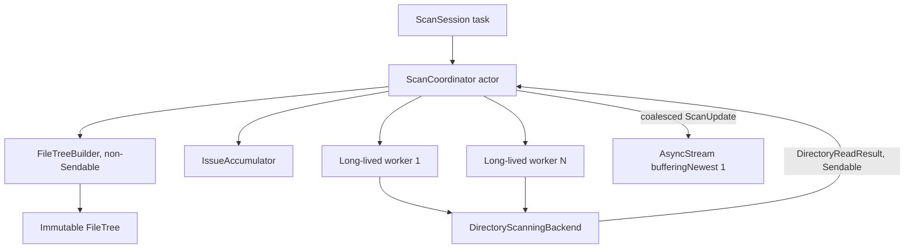

# M1 Scanner Core — implementation specification

Status: **Core/CLI implementation present; performance baseline remains an operational acceptance gate**
Decision record: [ADR-0002](adr/ADR-0002-m1-scanner-core-contracts.md)

Этот документ задаёт реализуемый контракт M1. Если будущий код расходится с ним по storage semantics, ownership, symlink/hard-link accounting или публичному scan lifecycle, сначала требуется новый ADR либо явное обновление ADR-0002.

## 1. Результат M1

M1 сканирует одну явно выбранную локальную директорию, строит согласованный `FileTree`, выдаёт top-N и сохраняет честный отчёт о неполных областях. Рабочего UI нет.

В scope:

- shallow directory reads через Foundation;
- metadata через `lstat`/эквивалент без перехода по symlink;
- фиксированное число долгоживущих workers;
- один владелец mutable builder;
- cooperative cancellation с валидным partial snapshot;
- logical и reported allocated accounting;
- детектирование hard links и детерминированная account-once policy;
- CLI и benchmark harness.

Вне scope:

- Whole Mac, network volumes и Full Disk Access UX;
- deep Foundation enumerator;
- `getattrlistbulk()`;
- APFS clone/shared-block accounting;
- persistent IDs, SQLite и FSEvents;
- progressive publication mutable/full `FileTree` во время scan.

## 2. Термины и size semantics

`FileNode.logicalSize` и `allocatedSize` — **inclusive accounted subtree totals**, а не универсальная характеристика filesystem object и не обещание reclaimable bytes.

| Node kind | logical contribution | allocated contribution |
|---|---:|---:|
| regular file, canonical hard-link entry | non-negative `st_size` | non-negative `st_blocks × 512`, checked |
| regular file, hard-link alias | `0` | `0` |
| symbolic link | link text length from `lstat.st_size` | `0` in M1; link allocation is not claimed |
| directory | sum of accounted children | sum of accounted children |
| socket/FIFO/device/other | `0` | `0` |

Directory inode/storage overhead intentionally не включается: иначе parent total не равен сумме визуализируемых children. Это ограничение записывается в `ScanAccountingPolicy` и CLI output.

`allocatedSize` означает только reported allocated blocks по доступной metadata. APFS clones могут указывать разные inode на разделяемые blocks, поэтому их размеры M1 суммирует повторно. Значение нельзя называть reclaimable.

Arithmetic использует `addingReportingOverflow`/`multipliedReportingOverflow`. Overflow, превышение ID/name limits или отрицательная неожиданная metadata завершают scan явной ошибкой либо issue согласно таблице ошибок; saturation запрещена.

## 3. Exact Domain structures

Ниже зафиксирован логический Swift API M1. Это не persistent/wire format; raw memory нельзя записывать на диск.

```swift
public struct NodeID: RawRepresentable, Hashable, Comparable, Sendable {
    public static let invalid = NodeID(rawValue: .max)
    public let rawValue: UInt32
}

public struct NameID: RawRepresentable, Hashable, Comparable, Sendable {
    public let rawValue: UInt32
}

public enum NodeKind: UInt8, Sendable {
    case regularFile
    case directory
    case symbolicLink
    case other
}

public struct NodeFlags: OptionSet, Hashable, Sendable {
    public let rawValue: UInt16

    public static let package            = NodeFlags(rawValue: 1 << 0)
    public static let hidden             = NodeFlags(rawValue: 1 << 1)
    public static let inaccessible       = NodeFlags(rawValue: 1 << 2)
    public static let incompleteSubtree  = NodeFlags(rawValue: 1 << 3)
    public static let hardLink           = NodeFlags(rawValue: 1 << 4)
    public static let hardLinkAlias      = NodeFlags(rawValue: 1 << 5)
    public static let volumeBoundary     = NodeFlags(rawValue: 1 << 6)
    public static let compressedHint     = NodeFlags(rawValue: 1 << 7)
}

public struct FileNode: Hashable, Sendable {
    public var logicalSize: UInt64
    public var allocatedSize: UInt64
    public var parent: NodeID
    public var firstChild: NodeID
    public var nextSibling: NodeID
    public var name: NameID
    public var kind: NodeKind
    public var flags: NodeFlags
}
```

Порядок полей intentional: два `UInt64`, четыре `UInt32`-sized value types и compact kind/flags. На arm64 ожидаемый target для `MemoryLayout<FileNode>.stride` — 40 bytes, но это проверяемый build-time/test invariant, не ABI promise. Изменение stride требует memory benchmark.

Правила IDs:

- `.invalid == UInt32.max` — единственный sentinel;
- valid IDs: `0...(UInt32.max - 1)`;
- root всегда `NodeID(rawValue: 0)`, `root.parent == .invalid`;
- node append-only, parent уже существует, поэтому `parent.rawValue < child.rawValue`;
- `firstChild`/`nextSibling` образуют forward-only sibling chains;
- `NodeID` действует только внутри одного snapshot и не является filesystem identity.

### 3.1 NameStore

```swift
public struct NameEntry: Sendable {
    public let offset: UInt32
    public let length: UInt32
}

public struct NameStore: Sendable {
    private let bytes: ContiguousArray<UInt8>
    private let entries: ContiguousArray<NameEntry>
}
```

Каждый node имеет ровно одну запись имени. M1 не делает global interning: его hash-index может стоить больше сохранённых повторов. Общий UTF-8 slab ограничен `< UInt32.max` bytes; превышение возвращает `FileTreeBuildError.nameStoreCapacityExceeded`, а не `precondition` crash на входных данных.

Полный путь не хранится. Он восстанавливается от `NodeID` по parent chain и соединяется с единственным `rootURL` из `ScanResult`. В pending work одновременно materialized не более одного directory URL на worker.

### 3.2 Sparse hard-link side table

Hard-link metadata не расширяет каждый `FileNode`:

```swift
public struct FileIdentity: Hashable, Sendable {
    public let device: UInt64     // scan-local representation of st_dev
    public let inode: UInt64      // st_ino
}

public struct HardLinkGroupID: RawRepresentable, Hashable, Sendable {
    public let rawValue: UInt32
}

public struct HardLinkGroup: Sendable {
    public let identity: FileIdentity
    public let canonicalNode: NodeID
    public let logicalSize: UInt64
    public let allocatedSize: UInt64
    public let reportedLinkCount: UInt32
    public let observedLinkCount: UInt32
}

public struct HardLinkMembership: Sendable {
    public let node: NodeID
    public let group: HardLinkGroupID
}

public struct HardLinkTable: Sendable {
    private let groups: ContiguousArray<HardLinkGroup>
    private let membershipsByNode: ContiguousArray<HardLinkMembership>
}
```

`membershipsByNode` сортируется по `NodeID` и ищется binary search. Mutable builder может использовать dictionary; published snapshot — compact arrays. `FileTree.intrinsicSizes(for:)` возвращает group sizes для alias, но обычные aggregation/visualization используют accounted node sizes.

### 3.3 FileTree и ScanResult

```swift
public struct FileTree: Sendable {
    public let root: NodeID
    private let nodes: ContiguousArray<FileNode>
    private let names: NameStore
    private let hardLinks: HardLinkTable

    public var count: Int { get }
    public subscript(_ id: NodeID) -> FileNode { get }
    public func name(for id: NodeID) -> String
    public func pathComponents(to id: NodeID) -> [String]
    public func children(of id: NodeID) -> ChildSequence
    public func intrinsicSizes(for id: NodeID) -> FileSizes
}

public struct ScanResult: Sendable {
    public let rootURL: URL
    public let tree: FileTree
    public let completion: ScanCompletion       // complete | cancelled
    public let accounting: ScanAccountingPolicy
    public let progress: ScanProgress
    public let issues: ScanIssueSummary
}
```

Published storage read-only. `FileTreeBuilder` не входит в public feature API. `ContiguousArray` используется, чтобы не допускать bridged backing storage; решение проверяется benchmark против `Array`, но публичная семантика от container choice не зависит.

## 4. FileTreeBuilder

`FileTreeBuilder` — один `final class`, потому что нужен уникальный mutable owner и большие COW copies недопустимы. Он **не `Sendable`** и живёт только внутри `ScanCoordinator` actor.

Build-only storage:

- mutable nodes and name store;
- `lastChildByParent: ContiguousArray<NodeID>` для O(1) sibling append;
- directory scan-state bitset/cursor;
- `Dictionary<FileIdentity, MutableHardLinkGroup>` только для `st_nlink > 1` regular files;
- bounded issue accumulator: counts + первые 256 samples каждого scan, а не URL для каждой ошибки.

Append rules:

1. parent существует и directory;
2. allocate `NodeID` with checked capacity;
3. append UTF-8 name;
4. patch `parent.firstChild` либо previous `lastChild.nextSibling`;
5. record raw leaf sizes/identity;
6. mark new directory pending unless inaccessible/volume boundary.

Finalize order:

1. прекратить выдачу work и определить incomplete directories;
2. сформировать hard-link groups;
3. выбрать canonical entry как lexicographically smallest relative path по stored UTF-8 components;
4. canonical сохраняет raw size, aliases получают accounted sizes `0` и `.hardLinkAlias`;
5. reverse NodeID pass складывает child totals в parent;
6. `.incompleteSubtree` распространяется к ancestors;
7. проверить root/link/name/tree invariants;
8. отбросить build-only arrays/dictionaries и freeze `FileTree`.

Reverse pass корректен, потому что parent всегда получает меньший `NodeID`, чем child. Рекурсия не используется.

## 5. Scanner boundaries

Текущий M0 `FileSystemScanner` и `ScannedNode` — provisional и должны быть заменены в начале реализации M1. Backend не назначает `NodeID` и не строит дерево.

```swift
public protocol DirectoryScanningBackend: Sendable {
    func readDirectory(_ request: DirectoryReadRequest) async -> DirectoryReadResult
}

public protocol FileSystemScanner: Sendable {
    func startScan(_ request: ScanRequest) -> ScanSession
}

public struct ScanRequest: Sendable {
    public let rootURL: URL
}

public struct ScanSession: Sendable {
    public let updates: AsyncStream<ScanUpdate>  // bufferingNewest(1)
    public let result: Task<ScanResult, Error>
    public func cancel()
}
```

`DirectoryReadResult` содержит один directory work ID и массив `DirectoryEntryRecord` с transient `String name`, `NodeKind`, `stat`-derived metadata, package/hidden hints и optional `FileIdentity`. Только coordinator превращает записи в `NodeID`.

В M1 traversal policies не являются пользовательскими switches: symlink всегда record-only, packages всегда traversed, volume boundary всегда root `st_dev`. Worker limit/progress cadence живут во внутреннем `ScanConfiguration` и доступны tests/benchmarks, но не меняют filesystem meaning.

Public updates содержат coalesced counters/status, но не per-item events и не копию live tree. Финальный `ScanResult` может быть `.cancelled` и содержит валидный partial tree. Progressive immutable tree checkpoints отложены до M2, потому что публикация COW storage во время дальнейшей мутации либо копирует миллионы nodes, либо нарушает ownership.

Fatal errors: invalid/missing/non-directory/symlink root, builder capacity, size overflow, violated invariant. Permission denied, disappeared entry, unreadable child metadata и crossed-volume directory — recoverable issues с incomplete coverage.

## 6. Ownership и concurrency



Ownership table:

| State | Единственный владелец | Пересекает concurrency boundary |
|---|---|---|
| mutable nodes/names/links | `ScanCoordinator` через non-Sendable builder | нет |
| pending directory state/cursor | coordinator | нет |
| directory URL for active work | конкретный worker | да, value в lease |
| read result batch | worker, затем coordinator | да, как `Sendable` value |
| backend | immutable/stateless or internally safe | да, `Sendable` |
| published `FileTree` | `ScanResult` consumers | только после freeze |

### 6.1 Fixed worker pool

Создаются ровно `workerLimit` долгоживущих worker tasks на scan, а не Task на directory. Baseline configuration:

```text
workerLimit = min(4, max(1, activeProcessorCount))
progressMinimumInterval = 200 ms
retainedIssueSamples = 256
```

Значения — безопасная исходная конфигурация, не performance claim. Benchmark обязан сравнить workers `1/2/4/8`; изменение production default требует recorded result.

Каждый worker выполняет цикл `claim -> shallow read -> submit`. Actor выдаёт следующий pending directory из append-only node storage. Отдельная очередь URL не растёт вместе с числом directories: pending work кодируется build-state bitset/cursor поверх уже существующих node IDs. Одновременно materialized не более `workerLimit` directory URLs и не более `workerLimit` results.

Worker никогда не мутирует builder. `submit` применяется одним actor-isolated batch call. UI/progress не обновляется на entry.

Actor scheduler имеет явные состояния `pendingCursor`, `inFlight`, `waitingWorkers`, `running/cancelling/finished`:

1. `claim()` линейно ищет следующий pending directory, помечает его in-flight и возвращает lease с монотонным `workID`;
2. если pending сейчас нет, но `inFlight > 0`, worker suspends в actor-owned continuation (не spin/poll);
3. если pending нет и `inFlight == 0`, actor возвращает `nil`, завершая worker;
4. `submit()` проверяет lease/workID, одним actor turn применяет весь result, уменьшает `inFlight` и возобновляет ожидающих workers, если появились directories;
5. cancellation атомарно меняет actor state и возобновляет всех waiters с `nil`.

Actor mailbox может принять не больше одного submitted result от каждого worker; отдельный reorder buffer отсутствует. Node order не зависит от filesystem correctness и не является stable API.

Foundation enumeration является blocking API. Чтобы не удерживать Swift cooperative executor, backend оборачивает каждый shallow call в `withCheckedContinuation` и выполняет его на выделенной `DispatchQueue` с QoS `.utility`. Каждый long-lived worker имеет не более одного outstanding block; следовательно одновременно queued/running I/O blocks не больше `workerLimit`. Это Apple-platform adapter detail, а Domain/Coordinator не зависят от GCD.

### 6.2 Foundation backend limitation

M1 использует `FileManager.contentsOfDirectory(at:includingPropertiesForKeys:options:)`: это shallow read, который не проходит subdirectories/symlinks, но возвращаемый порядок не определён. Поэтому child order и `NodeID` не считаются стабильными между scans. Canonical hard link выбирается по relative path, а CLI tie-breaking выполняется по path, не по ID.

Foundation возвращает целый array одной директории. Поэтому peak transient memory имеет нижнюю границу `workerLimit × largest concurrent directory result`. M1 не маскирует это «bounded batches»: wide-directory benchmark обязателен. Реальные fixed-size metadata batches появляются только с Darwin backend M6.

### 6.3 Cancellation

`ScanSession.cancel()`:

1. помечает coordinator cancelled и прекращает новые leases;
2. синхронно выставляет per-scan cancellation token Foundation adapter, чтобы текущий shallow read прекратил metadata loop между entries;
3. worker loops останавливаются после возврата текущего blocking system call;
4. результаты, не committed до cancellation cutoff, отбрасываются;
5. active/pending directories помечаются `.incompleteSubtree`;
6. builder выполняет hard-link finalization, aggregation и validation;
7. `result.value` возвращает `.cancelled` с валидным partial tree.

Таким образом structural bound — не более одного активного directory call на worker после cancel. `contentsOfDirectory` остаётся blocking Foundation API и не прерывается посередине system call, но последующая per-entry metadata обработка cooperative. Жёсткий wall-clock SLA без измерений и cancellable system API не обещается; latency измеряется отдельно.

## 7. Filesystem traversal semantics

### 7.1 Root и volume boundary

- Root проверяется через `lstat`; symlink root rejected, чтобы не перейти по нему неявно.
- M1 root должен быть directory на локально доступном volume.
- `rootDevice = st_dev`.
- Directory entry с другим `st_dev` добавляется как boundary node, получает `.volumeBoundary | .incompleteSubtree`, но не ставится в work.
- Cross-volume traversal отсутствует в M1; Whole Mac policy относится к M5.

### 7.2 Symbolic links

M1 policy — **record, never follow**. Boolean `followsSymbolicLinks` удаляется из M1 contract, чтобы небезопасный режим нельзя было включить случайно.

- shallow Foundation read возвращает link entry, но не его descendants;
- metadata читается `lstat`/`fstatat(..., AT_SYMLINK_NOFOLLOW)`;
- node kind — `.symbolicLink`;
- link target не разрешается, directory work не создаётся;
- dangling, self, parent и outside-root links обрабатываются одинаково;
- path reconstruction и будущие Finder/Trash actions адресуют сам link;
- logical contribution — длина link text; allocated contribution M1 — `0` и не заявляется как точная.

Дополнительный follow mode возможен только через отдельный ADR с root-containment, directory identity loop detection и explicit UX.

### 7.3 Hard links

M1 обрабатывает hard links только для regular files:

1. если `st_nlink <= 1`, entry обычный;
2. если `st_nlink > 1`, identity равна `(st_dev, st_ino)`;
3. все entries остаются отдельными nodes, потому что это разные directory names;
4. group canonical выбирается по smallest relative UTF-8 path;
5. size учитывается ровно один раз на canonical node; aliases имеют accounted size zero;
6. intrinsic size alias доступен через `HardLinkTable`;
7. если `observedLinkCount < reportedLinkCount`, summary сообщает links outside scan root.

Это accounting convention, а не оценка reclaimable space: canonical path может находиться в одном subtree, а другие links — в другом; удаление canonical name не освободит blocks, пока остаются aliases. CLI обязан пояснять это при наличии hard-link groups.

Directory identities `(st_dev, st_ino)` также отслеживаются для loop defense. Повторно встреченный directory identity записывается как issue и не сканируется второй раз даже если platform обычно запрещает directory hard links.

### 7.4 Packages

Scanner всегда проходит package/bundle directories и ставит `.package`. «Показывать package как один объект» — задача projection/UI, а не traversal: пропуск contents сделал бы размер package неизвестным. M0 default `.treatAsLeaf` считается superseded ADR-0002.

### 7.5 Concurrent mutations и access errors

- Entry исчез между listing и `lstat`: node не создаётся, счётчик `.itemDisappeared` увеличивается.
- Directory исчез/стал недоступен после создания node: node остаётся, получает `.inaccessible | .incompleteSubtree`, issue агрегируется.
- Child metadata unreadable: если безопасно известны name/type, создаётся incomplete node с zero size; иначе только issue sample.
- Scan не является atomic filesystem snapshot. `ScanResult` содержит start/end timestamps и issue counts; FSEvents reconciliation — M9.

## 8. Progress и issue reporting

`ScanProgress` различает:

- discovered entries;
- committed nodes;
- directories completed/pending/in-flight;
- accounted logical/allocated bytes **до финальной hard-link reassignment** как provisional counters;
- issue counts;
- elapsed duration.

До finalize byte counters помечаются provisional. Update не чаще 200 ms и только `bufferingNewest(1)`. Final result содержит точные итоговые totals.

`ScanIssueSummary` хранит counts по stable enum kind и bounded samples. Error description не является stable programmatic API. Полные абсолютные paths не сохраняются для каждой issue; sample хранит reconstructed relative path и error code/domain.

## 9. Invariants и test matrix

Обязательные unit/property tests:

### Storage

- `NodeID`/`NameID` stride 4; `NameEntry` stride 8; `FileNode` target stride 40 на arm64;
- capacity failures возвращаются как errors;
- invalid IDs не индексируют storage;
- UTF-8 names round-trip, включая empty root display name policy, emoji и normalization variants.

### Tree

- root ID 0 и parent invalid;
- parent ID меньше child ID;
- каждый non-root достижим ровно один раз через sibling chains;
- no sibling cycles/duplicate child;
- reverse aggregation совпадает с fixture oracle;
- deep tree не использует recursion;
- cancelled/inaccessible flags распространяются к root.

### Symlink/volume safety

- self, parent, mutual, dangling и outside-root symlinks никогда не порождают work;
- symlink root rejected;
- foreign `st_dev` directory не пересекается;
- repeated directory identity не сканируется повторно.

### Hard links

- две и много names одной identity дают один accounted size;
- canonical выбирается по path независимо от backend result order/worker count;
- links в разных subtrees и link outside root корректно отражают observed/reported counts;
- alias intrinsic size доступен через table;
- APFS clone fixture не ошибочно объединяется как hard link.

### Concurrency/cancellation

- число worker tasks никогда не превышает configured limit;
- backend одновременно получает не больше `workerLimit` calls;
- randomized completion order даёт одинаковые path-based result semantics;
- cancel прекращает новые leases и возвращает valid partial tree;
- slow worker не приводит к unbounded result buffering;
- progress consumer, который не читает updates, не тормозит scanner и не накапливает память.

Filesystem integration tests создают только temporary fixture root и никогда не удаляют данные вне него.

## 10. Benchmark harness

Harness является отдельным Release CLI mode и пишет JSON плюс краткую таблицу. Большие fixtures генерируются вне репозитория по versioned manifest/seed; пользовательские пути и имена в результаты не попадают.

Каждый result фиксирует:

- app commit/build, Swift compiler, build configuration;
- macOS version, hardware model, CPU count, RAM;
- filesystem type, volume local/removable, fixture manifest/seed;
- worker/progress configuration;
- wall, user CPU, system CPU;
- nodes/sec, directories/sec;
- peak RSS и approximate bytes/node;
- finalization time и name-store bytes;
- peak in-flight reads/results и task count;
- cancellation request-to-result latency;
- correctness digest: counts, totals, issues, hard-link groups.

### 10.1 Required synthetic cases

| ID | Fixture | Основной вопрос |
|---|---|---|
| B01 | empty + 1k mixed entries | fixed overhead/correctness |
| B02 | 100k files in one directory | Foundation wide-directory transient memory |
| B03 | depth 256, short names | iterative traversal/path reconstruction |
| B04 | balanced 1M nodes | throughput, RSS, bytes/node |
| B05 | 1M zero/tiny files | metadata-bound hot path |
| B06 | sparse files with large logical size | logical vs allocated correctness |
| B07 | 100k names / 1k hard-link identities across subtrees | registry/finalization/account-once |
| B08 | dangling/self/parent/outside-root symlink graph | no-follow and loop safety |
| B09 | long UTF-8, emoji, normalization variants | NameStore and sorting/path rules |
| B10 | nested `.app`/package-shaped directories | packages traversed and flagged |
| B11 | unreadable/disappearing entries | issue aggregation/partial coverage |
| B12 | mutation during scan | race behavior, no invariant corruption |
| B13 | cancellation during B02/B04 | request-to-partial-result latency |
| B14 | mounted disk-image boundary | `st_dev` boundary, manual/integration gate |

Минимум один opt-in real-tree benchmark допускается локально, но его raw paths/output не коммитятся.

### 10.2 Run protocol

- только optimized/Release build;
- workers: `1, 2, 4, 8` для B02/B04/B05/B07;
- один cold-ish run после fixture creation и минимум пять warm runs; macOS cache не называется «очищенным» без доказательства;
- сравниваются median и range; p90/p95 только при достаточном числе повторов;
- correctness digest должен совпадать для всех worker counts;
- baseline JSON сохраняется с toolchain/hardware metadata;
- после baseline regression gate: изменение median wall time или peak RSS более чем на 15% требует объяснения/повторного измерения, но не автоматически считается defect.

Fixture manifest, а не `du`, является correctness oracle. `du`/`find` используются как diagnostics: их hard-link, directory-block и APFS semantics могут отличаться от M1 accounting.

### 10.3 Acceptance gates M1

- все correctness digests совпадают с fixture manifests;
- no-follow и volume-boundary tests проходят;
- `MemoryLayout` targets проверены на Apple Silicon build;
- worker/in-flight/result-buffer maxima не превышают configured limits;
- B04 строится без recursion failure и без per-node/per-directory Task creation;
- B13 доказывает, что после cancel новых leases нет и остаётся не более одного активного Foundation call на worker;
- baseline numbers опубликованы без слов «быстро», «оптимально» или comparison claims до появления сопоставимого результата.

Числовой throughput/RSS SLA намеренно не задаётся до первого baseline. M6 оптимизирует только подтверждённые bottlenecks.

## 11. Implementation slices

Реализация M1 должна идти маленькими проверяемыми slices:

1. core/test/CLI target graph штатным Xcode workflow;
2. exact Domain types + `MemoryLayout`/invariant tests;
3. `FileTreeBuilder` append/finalize без filesystem;
4. hard-link table и fixture tests;
5. fake backend + fixed worker coordinator/cancellation tests;
6. Foundation shallow backend + temporary-directory integration tests;
7. top-N CLI и accounting warnings;
8. benchmark fixture generator/harness и baseline report.

Нельзя начинать Darwin backend, UI или persistence внутри M1.

## 12. Evidence used for filesystem contracts

- Apple documents `contentsOfDirectory` as a shallow enumeration that does not traverse symbolic links or subdirectories, and notes that result order is undefined: [FileManager contentsOfDirectory](https://developer.apple.com/documentation/foundation/filemanager/contentsofdirectory%28at%3Aincludingpropertiesforkeys%3Aoptions%3A%29).
- Apple `stat(2)` documentation distinguishes `lstat` from `stat`, defines `st_dev`, `st_ino`, `st_nlink`, and reports `st_blocks` in 512-byte units: [Mac OS X lstat/stat manual](https://developer.apple.com/library/archive/documentation/System/Conceptual/ManPages_iPhoneOS/man2/lstat.2.html).
- Local SDK headers are the compile-time source for `UF_COMPRESSED`; this remains a hint, not a reclaimable-space guarantee.
