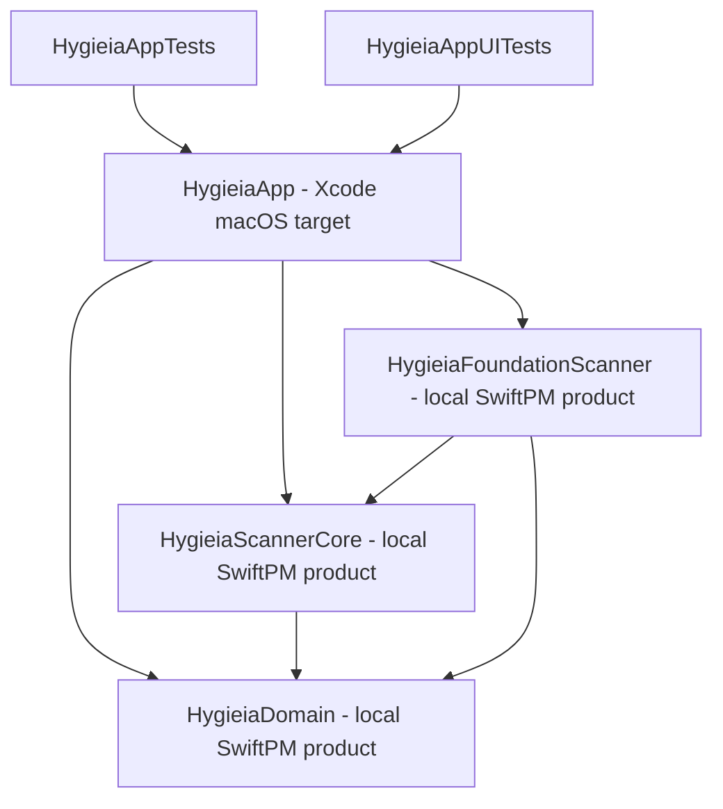
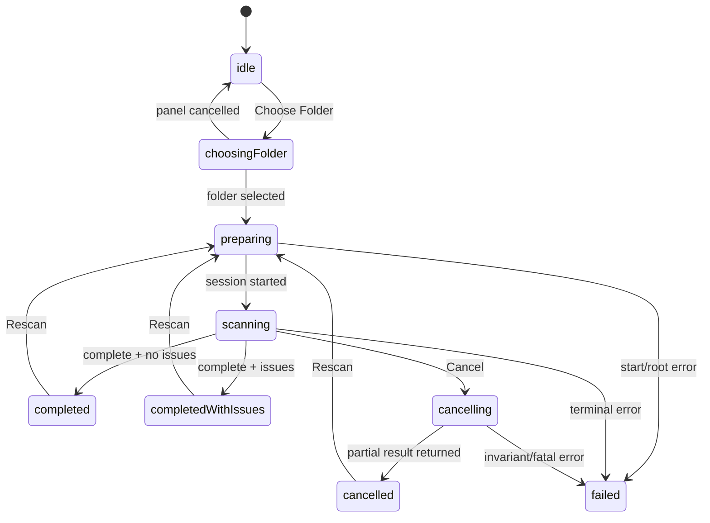

# M2 Basic macOS App — implementation specification

Status: **Implemented; manual acceptance gates remain**
Decision record: [ADR-0003](adr/ADR-0003-basic-macos-app-shell.md)

Этот документ задаёт реализуемый контракт M2 поверх фактических M1 products: `HygieiaDomain`, `HygieiaScannerCore` и `HygieiaFoundationScanner`. M2 создаёт настоящее sandboxed macOS application bundle, но не меняет scanner semantics и не начинает M3/M4/M5.

## 1. Результат M2

Пользователь может:

1. открыть нативное macOS-приложение;
2. выбрать одну локальную папку через системный panel;
3. запустить M1 scanner;
4. видеть честный indeterminate progress и отменить scan;
5. получить bounded список крупнейших файлов/каталогов;
6. выбрать строку и увидеть basic details;
7. повторно просканировать текущую папку.

В scope:

- SwiftUI app shell для macOS 14+;
- AppKit adapter для `NSOpenPanel`;
- App Sandbox и user-selected read-only folder access;
- `@MainActor` feature state machine;
- M1 `ScanSession` integration, progress и cancellation;
- Largest Items projection с bounded memory;
- native `Table`, details pane и status bar;
- keyboard commands, accessibility и light/dark mode;
- Xcode unit/UI test targets и app-level performance baselines.

Вне scope:

- Sunburst, layout и hit testing;
- Show in Finder и Move to Trash;
- volume/Whole Mac selection и Full Disk Access onboarding;
- live mutable/progressive tree presentation во время scan;
- persistent bookmarks, recent folders и automatic reopen;
- drag/drop, search, categories и settings screen;
- SQLite, FSEvents, telemetry и analytics.

## 2. Target graph и repository layout

M1 остаётся Swift Package. App target не компилирует копии `Domain/` или `Scanner/` sources.



Xcode project создаётся штатным Xcode workflow, а не вручную и не генератором. Он добавляет root `Package.swift` как local package dependency и links три library products.

Планируемый filesystem layout:

```text
Hygieia.xcodeproj/
App/
├── HygieiaApp.swift
├── AppComposition.swift
├── AppCommands.swift
└── Platform/
    ├── FolderPicker.swift
    └── FolderAccessLease.swift
Features/
├── Scan/
│   ├── ScanFeatureModel.swift
│   ├── ScanPhase.swift
│   ├── ScanRootView.swift
│   └── ScanStatusView.swift
├── Explorer/
│   ├── LargestItemsProjector.swift
│   ├── LargestItemsTable.swift
│   └── LargestItemRow.swift
└── FileDetails/
    └── FileDetailsView.swift
Tests/
├── AppTests/
└── AppUITests/
```

Project settings:

- deployment target: macOS 14.0, aligned with `Package.swift`;
- Swift language mode: Swift 6;
- app target only; no helper/XPC/login item;
- single main window scene;
- App Sandbox enabled;
- no third-party packages;
- no committed personal Development Team; unsigned CI build uses `CODE_SIGNING_ALLOWED=NO`;
- final bundle identifier/signing team остаются owner/release decision, не скрытым архитектурным default.

`.xcodeproj`, shared scheme, app entitlements и test plans являются versioned source artifacts. `xcuserdata` остаётся ignored.

## 3. Composition root и dependencies

`HygieiaApp` — единственный composition root:

```swift
@main
struct HygieiaApp: App {
    private let dependencies = AppDependencies.live

    var body: some Scene {
        Window("Hygieia", id: "main") {
            ScanSceneRoot(dependencies: dependencies)
        }
        .defaultSize(width: 1_100, height: 720)
        .commands { HygieiaCommands(/* narrow actions */) }
    }
}

@MainActor
struct ScanSceneRoot: View {
    @State private var model: ScanFeatureModel

    init(dependencies: AppDependencies) {
        _model = State(initialValue: dependencies.makeScanFeatureModel())
    }

    var body: some View {
        ScanRootView(model: model)
    }
}
```

Conceptual dependencies:

```swift
struct AppDependencies {
    let scanner: any FileSystemScanner
    let folderPicker: any FolderPicking
    let projector: any LargestItemsProjecting
}
```

Это обычная struct/factory, не DI container/framework. Live composition использует `FoundationScanner`, `AppKitFolderPicker` и `LargestItemsProjector`. Tests передают fakes через initializer.

Views не импортируют `HygieiaFoundationScanner`, не создают scanner и не вызывают filesystem APIs. AppKit импортируется только в `App/Platform` и, если потребуется, в узком commands/window adapter.

Model создаётся один раз на scene через `@State`, а не внутри повторно вычисляемого view body. Menu commands получают narrow `choose/rescan/cancel` actions через SwiftUI focused values; global singleton/model locator не используется.

## 4. Window и M2 layout

M2 не рисует пустой placeholder Sunburst. Он использует простой двухпанельный shell:

```text
┌────────────────────────────────────────────────────────────┐
│ Choose Folder   Rescan   Cancel   [Allocated | Logical]   │
├──────────────────────────────────────┬─────────────────────┤
│ Largest Items Table                  │ Selected Item       │
│ Name | Kind | Logical | Allocated    │ name / path         │
│                                      │ sizes / warnings     │
├──────────────────────────────────────┴─────────────────────┤
│ indeterminate progress / coverage / accounting status     │
└────────────────────────────────────────────────────────────┘
```

- Default window: `1100 × 720`; minimum target: `800 × 520`.
- До первого результата центральная область показывает empty/progress/error state.
- После результата `HSplitView` содержит `Table` и details pane; пользователь может менять ширину.
- Details pane может скрываться при малой ширине, но selection/details доступны через accessibility.
- Bottom status не является overlay и не блокирует table.
- Один window в M2; multiple independent scan windows отложены.

Toolbar:

- **Choose Folder…** — `⌘O`, недоступно во время active/cancelling scan;
- **Rescan** — `⌘R`, доступно при retained folder lease и inactive scan;
- **Cancel** — visible только для scanning/cancelling, `Esc`/cancel action;
- metric picker — **Allocated (reported)** / **Logical**.

M2 не показывает disabled Volume/Whole Mac/File Actions controls: отложенная функциональность не загромождает основной flow.

## 5. Folder picker и sandbox access

```swift
@MainActor
protocol FolderPicking {
    func chooseFolder() async -> FolderSelection?
}

@MainActor
final class FolderAccessLease {
    let url: URL
    func release()
}

struct FolderSelection {
    let url: URL
    let lease: FolderAccessLease
}
```

`AppKitFolderPicker` на MainActor создаёт `NSOpenPanel`:

```text
canChooseDirectories = true
canChooseFiles = false
allowsMultipleSelection = false
canCreateDirectories = false
```

Panel показывается asynchronous sheet/begin API, а не synchronous blocking `runModal`. Cancel возвращает `nil` и не меняет текущий result/root.

Entitlements M2:

```text
com.apple.security.app-sandbox = true
com.apple.security.files.user-selected.read-only = true
```

Read-write, Downloads, network, bookmarks и temporary exceptions отсутствуют.

Powerbox-selected folder URL сохраняется как `URL`, не превращается в path string и не создаётся заново. Access lease удерживается:

- с момента успешного выбора;
- во время scan;
- пока результат текущей папки показан и возможен Rescan;
- до выбора другой папки или закрытия feature/window.

Open-panel security scope уже предоставляется системным interaction. M2 не вызывает `startAccessingSecurityScopedResource()` повторно без причины; lease выполняет ровно требуемый balanced release через `stopAccessingSecurityScopedResource()` при завершении владения. Будущие resolved bookmarks будут иметь отдельную start/stop policy.

`release()` idempotent и вызывает stop не более одного раза; model lifecycle вызывает его явно. Нельзя получить новый URL через `URL(fileURLWithPath:)` из сохранённой строки: такой URL не переносит security scope исходного selection.

M2 не сохраняет bookmark/URL между launches. После relaunch пользователь снова выбирает folder. Это намеренно исключает stale bookmark и дополнительное entitlement до появления подтверждённого UX.

Scanner остаётся authority для root validation: symlink root, non-local root, missing directory и metadata errors отображаются как typed failures.

## 6. Feature state и invariants

```swift
enum ScanPhase: Equatable, Sendable {
    case idle
    case choosingFolder
    case preparing
    case scanning
    case cancelling
    case completed
    case completedWithIssues
    case cancelled
    case failed
}

enum SizeMetric: String, CaseIterable, Sendable {
    case reportedAllocated
    case logical
}

@MainActor
@Observable
final class ScanFeatureModel {
    private(set) var phase: ScanPhase
    private(set) var selectedRoot: URL?
    private(set) var progress: ScanProgress?
    private(set) var displayedResult: DisplayedScanResult?
    private(set) var rows: [LargestItemRow]
    private(set) var presentedError: ScanFailurePresentation?
    var selection: NodeID?
    var metric: SizeMetric

    private var folderLease: FolderAccessLease?
    private var session: ScanSession?
    private var updatesTask: Task<Void, Never>?
    private var resultTask: Task<Void, Never>?
    private var projectionTask: Task<Void, Never>?
    private var generation: UInt64
}
```

`ScanFeatureModel` — единственный presentation-state owner одного окна. `FileTree` остаётся source of truth; `rows` — bounded projection IDs/data, selection — snapshot-local `NodeID`.

State invariants:

| Phase | Session | Progress | Displayed result |
|---|---|---|---|
| idle | none | nil | nil |
| choosingFolder | none | unchanged | unchanged |
| preparing | creating | zero/nil | nil for new root; previous for rescan |
| scanning | active | current | nil or previous stale result |
| cancelling | cancelling | last current | nil or previous stale result |
| completed | none | final | complete current result |
| completedWithIssues | none | final | complete result with issue summary |
| cancelled | none | final | valid partial result |
| failed | none | nil/final | nil, or previous result explicitly marked stale |

`generation` увеличивается для каждого accepted scan start. Любой progress/result/projection callback проверяет generation; late completion старой работы не может заменить новый state.

## 7. State transitions



Detailed behavior:

1. **Choose Folder** недоступен во время active scan. Отмена panel сохраняет предыдущий state.
2. Успешный новый selection освобождает старую lease только после получения новой selection; старый displayed result очищается перед start новой папки.
3. **Rescan** использует текущую retained lease. Предыдущий result остаётся видимым как `staleWhileScanning`, чтобы UI не превращался в пустой экран.
4. Progress consumption и ожидание result — две scan-scoped tasks; они отменяются/заменяются как единая generation.
5. **Cancel** немедленно переводит state в `.cancelling`, вызывает `session.cancel()`, но не изображает завершение до `result.value`.
6. Полученный `.cancelled` result заменяет старый snapshot и маркируется partial/incomplete.
7. Fatal rescan error может оставить предыдущий snapshot только с явным `previousResultAfterFailedRescan`; он не называется current.
8. Закрытие окна отменяет active session, tasks и release folder lease.

В model одновременно не больше одной `ScanSession`, одной updates task, одной result waiter task и одной projection task. Task на row/node отсутствует.

## 8. Scanner integration и progress UX

`FoundationScanner.startScan` вызывается не с MainActor filesystem work, а через существующий `ScanSession`. MainActor только:

- создаёт session;
- consumes already-coalesced `ScanUpdate`;
- присваивает final immutable `ScanResult`;
- запускает/cancels background projection.

Во время первого scan:

- indeterminate `ProgressView`;
- folder display name;
- committed nodes, completed directories и provisional sizes, если есть update;
- elapsed time;
- Cancel button;
- нет fake percentage или ETA.

M1 не публикует live `FileTree`. Поэтому M2 не рисует progressive rows. После cancellation показывается согласованный partial tree с prominent incomplete banner. Это временно уточняет более широкую product hypothesis из `DESIGN.md`; live tree checkpoints требуют отдельного M2+/M3 design, который не нарушает COW ownership.

Progress UI обновляется только на входящих M1 updates (не чаще scanner cadence). VoiceOver announcement выполняется для start/cancelling/completed/failed и крупных редких status changes, но не для каждого progress tick.

## 9. Largest Items projection

Нельзя создавать `[Row]` для миллионов nodes или сортировать весь tree. M2 вводит presentation service:

```swift
protocol LargestItemsProjecting: Sendable {
    func project(
        tree: FileTree,
        metric: SizeMetric,
        limit: Int
    ) async throws -> [LargestItemRow]
}

struct LargestItemRow: Identifiable, Sendable {
    let id: NodeID
    let name: String
    let relativePath: String
    let kind: NodeKind
    let logicalSize: UInt64
    let allocatedSize: UInt64
    let flags: NodeFlags
}
```

Algorithm:

- linear pass по `FileTree`, excluding root;
- bounded min-heap максимум `K = 200` candidates;
- comparison по выбранной raw metric, затем по `NodeID` только как snapshot-local tie breaker;
- после pass — sort только K results; final equal-size display tie может использовать relative path;
- materialize name/path только для final K rows;
- time `O(N log K)`, additional memory `O(K + maxDepth)`;
- одна background task per result/metric change, не MainActor;
- stale projection result отвергается по generation/metric token.

Default metric — **Allocated (reported)**, потому что основной вопрос продукта связан с занятым пространством. UI всегда показывает слово `reported`/пояснение и обе колонки. Это не reclaimable estimate; APFS shared blocks и M1 accounting limitations доступны в status/details. Пользователь может переключить Logical; выбор M2 не persist между launches.

Rows с zero accounted size допускаются только если ненулевых candidates меньше K. Hard-link alias может показывать intrinsic size/details и label `Accounted at another link`, но не влияет на aggregate ordering как полный второй file.

## 10. Results table и details

SwiftUI `Table` получает не больше 200 `LargestItemRow` и single `NodeID?` selection.

Columns:

1. Name — primary, icon from `NodeKind`, без per-row filesystem lookup;
2. Kind;
3. Logical Size;
4. Allocated (reported).

Formatting rules:

- raw `UInt64` используется для selection/sort;
- presentation использует системный byte-count format;
- unknown и zero различаются; M2 structures currently provide exact accounted zero;
- aliases/incomplete/package status не кодируются одним цветом — есть icon/label/accessibility text;
- полный path не повторяется в каждой visible cell без необходимости.

Details pane для selected row показывает:

- name, kind и relative path;
- logical и reported allocated size;
- текущую accounting metric;
- `incompleteSubtree`, inaccessible, package, volume boundary warnings;
- hard-link canonical/alias explanation, если доступно через `FileTree`;
- scan issue summary, если selected subtree имеет только global evidence — без ложной точности.

Show in Finder и Trash buttons отсутствуют до M4. Double-click не выполняет drill-down до M3 и не запускает filesystem action.

## 11. Errors и coverage presentation

Typed mapping:

| Scanner condition | Presentation | Next action |
|---|---|---|
| `rootMissing` | Folder is no longer available | Choose Folder |
| `rootIsNotDirectory` | Selected item is not a folder | Choose Folder |
| `rootIsSymbolicLink` | Symbolic-link roots are not scanned | Choose actual folder |
| `rootIsNotLocalVolume` | M2 scans local folders only | Choose local folder |
| `rootMetadataFailed` | Folder metadata could not be read | Retry / Choose Folder |
| builder/invariant error | Scan could not produce a valid result | Retry; preserve diagnostics, not raw tree |
| complete with issues | Result is incomplete in named/sample areas | Review issues / Rescan |
| cancelled | Partial result | Rescan |

UI не показывает raw errno как основное сообщение, но diagnostic details могут содержать stable error code. Recoverable issues не превращаются в modal alert storm: один coverage banner, counts и bounded samples.

Error при выборе/scan не освобождает access lease до решения state transition; balance выполняется централизованно. Никакого автоматического privilege escalation или Full Disk Access prompt в M2.

## 12. Commands и lifecycle

Commands вызывают методы model через narrow command actions, а не дублируют business logic:

| Command | Shortcut | Enablement |
|---|---|---|
| Choose Folder… | `⌘O` | inactive scan |
| Rescan | `⌘R` | selected root + inactive scan |
| Cancel Scan | `Esc` | scanning/cancelling |

App termination/window close:

1. cancel session;
2. cancel updates/result/projection tasks;
3. release folder access once;
4. do not wait indefinitely for uninterruptible Foundation read during UI termination.

No background agent, menu-bar extra, dock progress or notifications in M2.

## 13. Accessibility и macOS behavior

- Native `Table` остаётся полным альтернативным представлением будущей visualization.
- Каждая row label включает name, kind, выбранный size и incomplete/alias state.
- Selection keyboard navigation работает системно; details имеет логичный focus order.
- Toolbar actions доступны также из menu commands.
- Focus ring и selection используют system appearance, не custom color-only state.
- Empty/error/progress states имеют headings и actionable buttons.
- Phase transitions объявляются politely; per-tick counters не создают announcement spam.
- При Increase Contrast информация сохраняется text/icons.
- Reduce Motion: M2 использует только короткий opacity/state transition либо немедленную замену; никаких geometry animations.
- Light/dark mode используют semantic system colors/materials; brand palette не создаётся.
- Dynamic Type/увеличенный text не обрезает критические actions; минимум окна не является accessibility lock — панели могут scroll/collapse.

VoiceOver и keyboard-only flow являются manual acceptance gates на реальном app bundle, не считаются доказанными unit tests.

## 14. Tests

### 14.1 App unit tests

`HygieiaAppTests` использует fake folder picker, scanner/session и projector:

- panel cancel не меняет текущий state;
- selection создаёт ровно один scan;
- state transition complete / complete-with-issues / cancelled / failed;
- Cancel вызывает session cancellation один раз и ждёт result;
- late progress/result старой generation игнорируется;
- rescan сохраняет previous result только с stale label;
- new folder освобождает old lease ровно один раз;
- window/model teardown balances lease и cancellation;
- metric switch cancels stale projection;
- no action is enabled in invalid phase.

### 14.2 Projection tests

- oracle comparison с full sort на small fixtures;
- K=0/1/200, tree меньше/больше K;
- allocated/logical ordering;
- deterministic final ordering for equal sizes;
- hard-link aliases и zero sizes;
- deep paths without recursion;
- randomized trees;
- proof/instrumentation that retained candidates never exceed K;
- 1M-node fixture completes off MainActor without proportional row/path storage.

### 14.3 Integration tests

- app feature + real `FoundationScanner` on temporary fixture;
- permission/incomplete result presentation;
- cancellation returns partial table state;
- sandboxed selected-folder scan verified manually/on signed development app;
- security-scope release checked with instrumented adapter.

### 14.4 UI tests

Test-only composition under `#if DEBUG` may inject a temporary fixture URL; production build has no bypass. UI tests cover:

- empty state;
- scan to table;
- row selection/details;
- metric toggle;
- cancel state;
- error/coverage banner;
- menu shortcuts and basic keyboard navigation.

Actual `NSOpenPanel` selection and sandbox grant remain a separate manual integration gate because injected UI tests do not prove Powerbox behavior.

## 15. App performance and responsiveness checks

M2 не делает speed claims. Он добавляет baseline scenarios:

| ID | Scenario | Measurements |
|---|---|---|
| A01 | cold app launch to empty state | wall time, main-thread stalls |
| A02 | scan with 5 Hz progress | update count, main-thread responsiveness |
| A03 | project 1M-node `FileTree`, K=200 | wall, CPU, peak RSS, retained candidates |
| A04 | metric toggle on 1M nodes | cancellation, stale result rejection, latency |
| A05 | display/scroll/select 200 rows | hangs, allocations, selection latency |
| A06 | cancel active scan | click-to-cancelling and click-to-partial-result |

Structural gates:

- filesystem enumeration не выполняется на MainActor;
- projection не выполняется на MainActor;
- UI хранит максимум K rows, не object/view model per node;
- scanner updates не усиливаются до per-item UI events;
- no synchronous wait on `ScanSession.result`;
- Main Thread Checker/Swift concurrency diagnostics не показывают нарушений в tested flows.

Числовые thresholds фиксируются только после первой Release baseline на Apple Silicon. Изменение baseline требует hardware/toolchain metadata и не считается доказательством улучшения без сопоставимого run.

## 16. Acceptance criteria M2

M2 завершён только если:

- Xcode-created project и shared scheme versioned;
- Debug и Release app targets собираются на Apple Silicon;
- `swift run hygieia-verify` по-прежнему проходит;
- app links local M1 package products без duplicate source membership;
- App Sandbox и read-only user-selected entitlement подтверждены built entitlements;
- NSOpenPanel выбирает folder, cancel безопасен;
- scan/progress/cancel/result/error state transitions проверены;
- complete/cancelled/incomplete results не смешиваются;
- Largest Items использует bounded K=200 projection off MainActor;
- keyboard and VoiceOver smoke gates пройдены;
- actual sandboxed folder scan выполнен вручную;
- Sunburst, Finder/Trash, Whole Mac, bookmarks, SQLite и FSEvents отсутствуют.

Успешный Xcode build не доказывает Powerbox access, VoiceOver, cancellation latency или main-thread responsiveness — эти gates называются отдельно.

## 17. Implementation slices

1. Создать Xcode macOS app/test targets штатным Xcode и подключить local package products.
2. Добавить sandbox/read-only entitlements и AppKit folder-picker/access lease tests.
3. Реализовать `ScanFeatureModel` с fake scanner state-machine tests.
4. Подключить real M1 `ScanSession`, progress и cancellation.
5. Реализовать bounded `LargestItemsProjector` и tests.
6. Собрать empty/progress/results/details SwiftUI shell.
7. Добавить commands, errors, accessibility и UI tests.
8. Выполнить app performance baseline и manual sandbox/VoiceOver gates.

Каждый slice сохраняет рабочими SwiftPM CLI/verification. M3 не начинается внутри M2.

## 18. Evidence for platform choices

- Apple documents `NSOpenPanel.canChooseDirectories` as the control that permits directory selection: [NSOpenPanel canChooseDirectories](https://developer.apple.com/documentation/appkit/nsopenpanel/canchoosedirectories).
- Apple App Sandbox documentation defines mutually exclusive user-selected read-only/read-write entitlements and grants access to folders selected through an open panel: [Enabling App Sandbox](https://developer.apple.com/library/archive/documentation/Miscellaneous/Reference/EntitlementKeyReference/Chapters/EnablingAppSandbox.html).
- Current Apple guidance states that open-panel folder access extends recursively to items inside the selected folder and that access should be relinquished when finished: [Accessing files from the macOS App Sandbox](https://developer.apple.com/documentation/security/accessing-files-from-the-macos-app-sandbox).
- Apple requires balanced security-scope access/release calls when the app explicitly starts access: [startAccessingSecurityScopedResource](https://developer.apple.com/documentation/foundation/url/startaccessingsecurityscopedresource%28%29).
- SwiftUI `Table` provides native collection rows and selection behavior appropriate for a bounded macOS results list: [SwiftUI Table](https://developer.apple.com/documentation/swiftui/table).
