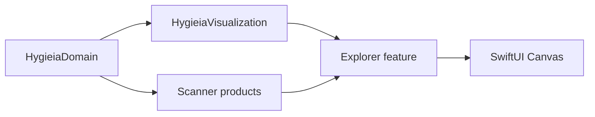

# M3 — Sunburst MVP

Статус: **реализован в коде; manual acceptance gates остаются открыты**. Текущая product policy намеренно показывает один уровень за раз поверх generic bounded projection pipeline.

## 1. Результат milestone

M3 превращает завершённый `FileTree` из M2 в интерактивную, ограниченную по памяти Sunburst-проекцию. Пользователь может выбрать сектор, увидеть те же данные в списке/details, сделать каталог новым visual root, вернуться Back/Forward/Up и пройти по breadcrumbs — без нового filesystem scan.

M3 сохраняет основной поток данных:

```text
immutable FileTree snapshot
    + visibleRoot
    + selected size metric
    + viewport budget class
        -> VisualizationTreeBuilder
        -> SunburstProjection (bounded flat values)
        -> SunburstLayout (pure geometry)
        -> SwiftUI Canvas

pointer -> SunburstHitTester -> presentation selection/navigation
```

`FileTree` остаётся source of truth. Проекция, layout, `Other`, hover и selection snapshot-local и могут быть отброшены в любой момент.

## 2. Scope

В M3 входят:

- отдельный pure SwiftPM product `HygieiaVisualization`, зависящий только от `HygieiaDomain`;
- bounded `VisualizationTreeBuilder` с агрегацией маленьких siblings в virtual `Other`;
- deterministic radial layout и индекс по кольцам;
- pure hit testing;
- SwiftUI `Canvas` renderer в application target;
- hover, single-click selection и double-click/Return drill-down;
- Back, Forward, Up и breadcrumbs;
- единая selection для диаграммы, direct Contents list и details;
- accessibility representation и Reduce Motion behavior;
- unit, integration, UI tests и воспроизводимые benchmarks.

## 3. Explicit non-goals

M3 не включает:

- live/progressive `FileTree` во время scan;
- изменение scanner, повторный scan при navigation или incremental update;
- Finder/Trash actions (M4);
- Whole Mac, volumes или Full Disk Access (M5);
- `getattrlistbulk()` и scanner optimization (M6);
- SQLite/FSEvents;
- GPU/Metal renderer, Swift Charts или сторонний chart framework;
- постоянный projection cache между запусками;
- поиск, категории, in-sector text labels и финальную palette/design system;
- раскрытие `Other` как отдельного browsable дерева.

## 4. Target и dependency boundaries

M3 добавляет в корневой `Package.swift`:

```text
HygieiaVisualization (Visualization/)
└── HygieiaDomain
```

Внутри package target находятся только:

- projection contracts и builder;
- viewport policy/value geometry;
- layout;
- hit testing;
- renderer-neutral style keys.

Он не импортирует SwiftUI/AppKit, не знает о scanner, `URL`, gestures или feature state. Простые geometry values используют `Double`, чтобы pure tests не требовали UI framework.

Application target links `HygieiaVisualization`. `Features/Explorer/SunburstView.swift` адаптирует layout к `Canvas`, pointer/keyboard events и accessibility. Domain/Scanner files не получают duplicate Xcode target membership.



## 5. Exact core contracts

Имена могут быть уточнены при реализации, но изменение semantics ниже требует обновления specification/ADR.

```swift
public enum SunburstSizeMetric: Hashable, Sendable {
    case logical
    case reportedAllocated
}

public enum SunburstItemID: Hashable, Sendable {
    case node(NodeID)
    case other(parent: NodeID)
}

public struct ProjectionNodeIndex: RawRepresentable, Hashable, Sendable {
    public let rawValue: UInt32
}

public struct ProjectionFlags: OptionSet, Hashable, Sendable {
    public let rawValue: UInt8

    public static let incompleteSource = Self(rawValue: 1 << 0)
    public static let childrenHiddenByDepth = Self(rawValue: 1 << 1)
    public static let childrenHiddenByBudget = Self(rawValue: 1 << 2)
}

public struct ProjectionNode: Hashable, Sendable {
    public let item: SunburstItemID
    public let parent: ProjectionNodeIndex?
    public let firstChild: ProjectionNodeIndex?
    public let nextSibling: ProjectionNodeIndex?
    public let value: UInt64
    public let aggregatedDirectChildCount: UInt64
    public let zeroValueDirectChildCount: UInt64
    public let hiddenPositiveDirectChildCount: UInt64
    public let hiddenPositiveDirectChildValue: UInt64
    public let depth: UInt16
    public let flags: ProjectionFlags
}

public struct ProjectionSummary: Hashable, Sendable {
    public let visitedSourceNodeCount: UInt64
    public let representedRealNodeCount: Int
    public let otherNodeCount: Int
    public let observedZeroValueNodeCount: UInt64
    public let observedHiddenPositiveNodeCount: UInt64
    public let observedHiddenPositiveValue: UInt64
    public let hasDepthLimitedBranches: Bool
    public let hasBudgetLimitedBranches: Bool
}

public struct SunburstProjection: Sendable {
    public let sourceRoot: NodeID
    public let metric: SunburstSizeMetric
    public let nodes: ContiguousArray<ProjectionNode>
    public let summary: ProjectionSummary
}
```

Инварианты:

- `nodes[0]` всегда real `.node(sourceRoot)`, depth `0`; это центр, а не кольцевой sector;
- `nodes.count <= request.maximumNodeCount`; root и все `Other` входят в лимит;
- ровно один `Other` может существовать для одного represented parent;
- identity `Other` — только `.other(parent:)`; меняющиеся count/value не входят в identity;
- `Other` является leaf и не записывается в `FileTree`;
- `aggregatedDirectChildCount` для real node равен `0`, для `Other` — количеству объединённых непосредственных children;
- zero-value children не создают zero-angle sector и считаются отдельно;
- если positive omitted remainder сам меньше minimum angle или для `Other` не осталось budget slot, он не получает микросегмент: checked count/value сохраняются на real parent в `hiddenPositive...` и дают незаполненную часть следующего ring;
- siblings хранятся в descending value order, tie-break — ascending `NodeID`; `Other` идёт последним;
- projection хранит integer bytes, а не округлённые проценты.

`ProjectionSummary` считает только source nodes, фактически посещённые bounded traversal. Он не выдаёт observed count за полный descendant count ветки, остановленной depth/budget policy.

Ранний `Visualization/SunburstSegment.swift`, где count являлся частью `SunburstItem.other`, заменяется этими contracts. Это намеренное несовместимое уточнение ещё не использовавшегося M0 stub.

### 5.1 Request и budget

```swift
public struct SunburstProjectionRequest: Hashable, Sendable {
    public let root: NodeID
    public let metric: SunburstSizeMetric
    public let maximumDepth: UInt16
    public let maximumNodeCount: Int
    public let minimumAngularSpanByDepth: ContiguousArray<Double>
}
```

Builder валидирует root, `maximumDepth`, node cap и конечные positive angles. Invalid request возвращает typed error; он не исправляется silently.

Текущая application viewport policy:

| Geometry | Maximum depth | Node cap |
|---|---:|---:|
| недостаточно места для одного кольца 28 pt | 0, center/fallback only | 1 |
| outer radius `< 220 pt` | 1, direct children only | 768 |
| outer radius `220...419 pt` | 1, direct children only | 1536 |
| outer radius `>= 420 pt` | 1, direct children only | 2048 |

Для каждого кольца minimum angle равен `max(0.5°, 3 pt / midRadius)`. Константы — initial UX/performance budgets, а не доказанные optimum. Их изменение по результатам M3 benchmarks/UX tests не требует нового ADR, пока сохраняются bounded output и contract `Other`.

Projection cache key использует `(scanGeneration, root, metric, budgetClass)`, а не каждый pixel размера окна. Exact radii layout пересчитываются на resize; полный `FileTree` повторно обходится только при смене snapshot/root/metric или budget class.

## 6. Projection algorithm

Builder работает breadth-first по видимым кольцам. Он не строит `[allChildren]`, не сортирует миллион children и не восстанавливает paths/names.

Для represented parent:

1. Получить его logical angular span: root имеет `2π`, descendant наследует span своего sector.
2. Если достигнут depth limit, оставить node leaf и поставить `childrenHiddenByDepth` при наличии children.
3. Вычислить local capacity как `floor(parentSpan / minimumSpanForNextDepth)`, ограничить глобальным остатком node cap.
4. Если capacity не позволяет показать meaningful split, оставить parent leaf с `childrenHiddenByBudget`.
5. Один раз stream-обойти direct children. Children с выбранным size `0` только считаются. Для positive child вычислить raw share `parentSpan * childValue / parentValue`: child ниже minimum angle сразу попадает в omitted checked sum/count, остальные проходят через bounded min-heap не больше local capacity.
6. Если eligible children превышают capacity, heap оставляет крупнейшие; losers добавляются в omitted sum/count. Tie-break — ascending `NodeID`.
7. Если omitted total сам достигает minimum angle и есть budget slot, зарезервировать этот slot, при необходимости переместить smallest retained child в omitted и materialize один `Other`. Если aggregated total всё ещё меньше minimum angle либо slot отсутствует, сохранить его в `hiddenPositive...` real parent без отдельного pointer target. При capacity `< 2` и наличии omitted parent не раскрывается.
8. Parents одного ring обрабатываются по descending angular span, tie-break — `NodeID`. Это отдаёт оставшийся global budget наиболее видимым branches; меньшие parents остаются видимыми leaves.
9. Периодически проверять cancellation; cancellation не публикует half-built projection.

Worst-case traversal для нового root может прочитать все direct/visited children, что необходимо для корректного выбора крупнейших. Auxiliary storage остаётся `O(maximumNodeCount)`, а output — не более 2048 nodes. Resize в том же budget class этот traversal не повторяет.

### 6.1 Accounting checks

Для раскрываемого directory сумма accounted values его direct children должна совпадать с value directory в выбранной metric. `FileTree` M1 поддерживает этот инвариант и для partial snapshots. Несовпадение не нормализуется silently: builder возвращает `inconsistentAccounting(parent:)`, UI сохраняет список/details и показывает chart preparation error.

Regular file, symlink, `other` filesystem kind и hard-link alias без children являются leaves. Hard-link alias с accounted size `0` не получает sector, но остаётся доступен в list/details. Packages не получают особой chart semantics: если scanner прошёл package, диаграмма может раскрыть его как directory.

Если value visual root равен `0` в выбранной metric, projection содержит только center и zero-value summary. UI объясняет отсутствие ненулевых данных и предлагает переключить metric; он не подменяет metric автоматически.

## 7. Layout contracts

```swift
public struct SunburstViewport: Hashable, Sendable {
    public let width: Double
    public let height: Double
}

public struct SunburstSegmentIndex: RawRepresentable, Hashable, Sendable {
    public let rawValue: UInt32
}

public struct SunburstSegment: Hashable, Sendable {
    public let item: SunburstItemID
    public let projectionIndex: ProjectionNodeIndex
    public let parentSegment: SunburstSegmentIndex?
    public let value: UInt64
    public let depth: UInt16
    public let startAngle: Double
    public let endAngle: Double
    public let innerRadius: Double
    public let outerRadius: Double
}

public struct NodeSegmentEntry: Hashable, Sendable {
    public let node: NodeID
    public let segment: SunburstSegmentIndex
}

public struct SunburstLayoutResult: Sendable {
    public let sourceRoot: NodeID
    public let viewport: SunburstViewport
    public let centerRadius: Double
    public let outerRadius: Double
    public let segments: ContiguousArray<SunburstSegment>
    public let ringRanges: ContiguousArray<Range<Int>>
    public let nodeSegmentsByNodeID: ContiguousArray<NodeSegmentEntry>
}
```

Geometry convention:

- origin находится в центре viewport;
- angle `0` у 12 часов и растёт clockwise до `2π`;
- root занимает center disc и не входит в `segments`;
- первый уровень имеет depth `1`;
- angles логически half-open `[startAngle, endAngle)`; при полностью represented accounting последний sibling точно замыкается на `parent.endAngle`, а hidden remainder остаётся явным пустым angular interval;
- радиальные интервалы half-open на внутренних boundaries, outermost boundary включена;
- `outerRadius = min(width, height) / 2 - 12 pt`;
- `centerRadius = clamp(outerRadius * 0.18, 44 pt, 84 pt)`;
- usable radius делится на одно кольцо direct children толщиной не меньше `28 pt`; generic layout contract продолжает поддерживать bounded multi-depth requests для тестов и будущих compositions;
- radial/angle visual gaps применяет renderer внутрь logical sector; logical hit area остаётся непрерывной.

Layout использует integer `value` для порядка и `Double` только для ratio/geometry. Ширина child считается относительно source parent value, поэтому hidden remainder не перераспределяется между показанными sectors. Для fully represented sibling group последний end angle присваивается из parent boundary, а не является суммой округлений. Non-finite geometry — typed error.

`segments` сгруппированы по increasing depth, внутри ring — по increasing start angle. `ringRanges` позволяет hit test выбрать только одно кольцо. Дополнительный bounded lookup `NodeID -> segment index` строится из represented real nodes для синхронизации selection; он не содержит все nodes source tree.

`ringRanges[0]` всегда empty и соответствует center/root; индекс массива равен sector depth. `nodeSegmentsByNodeID` отсортирован по `NodeID` и используется binary search, поэтому layout не публикует mutable hash table.

## 8. Hit testing

```swift
public enum SunburstHit: Hashable, Sendable {
    case center(NodeID)
    case segment(SunburstSegmentIndex)
}
```

Алгоритм не читает `FileTree`:

1. `dx`, `dy`, `radius = hypot(dx, dy)` относительно центра.
2. `radius < centerRadius` возвращает center; `radius > outerRadius` — `nil`.
3. Radius однозначно выбирает depth/ring.
4. `angle = atan2(dx, -dy)`; negative angle нормализуется добавлением `2π`.
5. В `ringRanges[depth]` binary search находит последний segment с `startAngle <= angle`, затем проверяет end boundary.

Visual gap не создаёт dead zone: hit test использует logical bounds. На общей angular/radial boundary применяется half-open rule выше. Hover complexity — `O(log segmentsInRing)`, а не обход projection/FileTree.

## 9. Ownership и concurrency

### 9.1 Source ownership

- scanner публикует immutable `ScanResult/FileTree` так же, как в M2;
- M3 не добавляет mutable tree и live snapshots;
- один `@MainActor @Observable ScanFeatureModel` остаётся presentation owner окна согласно ADR-0003;
- внутри него появляется value `ExplorerState`, но не второй independent observable source of truth.

```swift
struct ExplorerState {
    var visibleRoot: NodeID
    var selection: ExplorerSelection?
    var hoveredItem: SunburstItemID?
    var backStack: [NodeID]
    var forwardStack: [NodeID]
    var projectionPhase: ProjectionPhase
}

enum ExplorerSelection: Hashable {
    case node(NodeID)
    case other(parent: NodeID)
}
```

Existing M2 `NodeID?` selection расширяется до `ExplorerSelection?`, потому что virtual `Other` должен быть selectable, но не может притворяться filesystem node.

### 9.2 Work scheduling

- projection и exact layout выполняются off-main через injected `Sendable` async services;
- одна cancellable projection task и одна layout task принадлежат feature model;
- task захватывает immutable snapshot, request и generation token;
- результат применяется на MainActor только при совпадении `scanGeneration`, root, metric и budget class;
- новый scan/root/metric/budget отменяет старую projection; новый viewport отменяет старый layout;
- cancellation checks выполняются минимум между parent groups и каждые 4096 streamed children;
- hover и hit testing синхронны на MainActor по bounded layout index и не создают `Task`;
- Canvas closure получает готовый immutable layout и не инициирует work.

Resize events coalesced. Pixel resize внутри budget class меняет layout, но не projection; переход между classes вызывает новую projection. M3 benchmark определяет достаточный debounce, initial policy — trailing 50 ms для projection rebuild без задержки pointer hit testing.

## 10. Application state и navigation

На публикации нового snapshot:

- `visibleRoot = tree.root`;
- history/forward/hover очищаются;
- selection становится `.node(tree.root)`;
- list, projection и details строятся для того же snapshot/metric.

Правила navigation:

- single click выбирает sector/center/`Other`, но не меняет root;
- double click по represented directory, `Return` или **Open in Chart** вызывает `drill(to:)`;
- `drill(to:)` проверяет, что ID принадлежит текущему snapshot, является descendant current root и имеет directory kind; затем push current root в Back, очищает Forward и меняет visible root;
- Back переносит current root в Forward и восстанавливает последний Back;
- Forward симметричен;
- Up идёт к structural parent и считается новой navigation: current уходит в Back, Forward очищается;
- breadcrumb ancestor выполняет ту же validated navigation;
- `Other` никогда не drillable;
- ни одна navigation operation не вызывает scanner.

После root change список **Contents** и chart строятся из direct children `visibleRoot`, чтобы table/chart/details описывали один context и не раскрывали все внутренние уровни заранее. Selection становится новым root. Если direct child скрыт из chart из-за budget, chart подсвечивает соответствующий `Other`, а details объясняет агрегацию.

Stale result во время rescan остаётся navigable, но помечен как stale согласно M2. Когда приходит новый snapshot, snapshot-local IDs/history не переносятся по raw value.

## 11. Canvas renderer

`SunburstView` — thin SwiftUI adapter:

- один immediate-mode `Canvas`, а не View на sector;
- annular paths строятся только из `SunburstLayoutResult`;
- renderer не читает names/paths и не выполняет traversal;
- hover/selection/focus передаются как малые style values;
- `Other` имеет отдельную neutral style role;
- selection/focus обозначаются stroke/contrast, не только hue;
- M3 не рисует text labels внутри sectors; center label, tooltip и details дают текст;
- `rendersAsynchronously` не включается по предположению — режим выбирается после render benchmark и проверки latency/accessibility state.

Цвета используют небольшой system-aware набор branch roles. Их назначение deterministic внутри projection, но palette не является архитектурным contract. Light/dark и Increase Contrast проверяются отдельно.

Pointer location приходит через continuous hover modifier, после выхода hover очищается. Tooltip задерживается кратко, привязан к bounded hit result и не перехватывает pointer. Click recomputes hit из своей location, а не доверяет потенциально устаревшему hover.

Drill-down в M3 использует одну короткую context transition для всей chart, без per-sector spring/morph. При Reduce Motion результат меняется без geometry animation. Resize и metric changes не запускают тысячи animations.

## 12. Desktop composition

M3 развивает M2 shell в три области:

```text
┌─────────────────────────────────────────────────────────────┐
│ Back Forward Up | Breadcrumbs | metric | scan actions      │
├────────────────┬─────────────────────────┬──────────────────┤
│ Contents       │                         │ Selected item    │
│ direct children│        Sunburst         │ details          │
│                │                         │                  │
├────────────────┴─────────────────────────┴──────────────────┤
│ scan/projection status                                     │
└─────────────────────────────────────────────────────────────┘
```

При ограниченной ширине details может скрываться в inspector/panel, затем list. Chart не уменьшается ниже geometry fallback. Скрытие панели не уничтожает selection.

Breadcrumbs показывают scan-root-relative components, восстанавливаемые по parent chain только для visual root. Середина сокращается при недостатке места; root и current component остаются доступны.

## 13. Accessibility и keyboard

Canvas сам по себе не даёт interactivity/accessibility отдельным drawn elements. Поэтому chart получает bounded synthetic accessibility representation:

- hierarchy следует projection parent/child order;
- каждый real sector сообщает name, formatted raw metric, percentage of visible root и level;
- `Other` сообщает aggregated direct-child count и total;
- default action выбирает; дополнительное **Open in Chart** существует только у directory;
- center/root, Back/Forward/Up и breadcrumbs доступны как обычные controls;
- synchronized Contents table остаётся полноценной keyboard/VoiceOver альтернативой;
- focus indicator видим независимо от цвета;
- zero-size и hidden-by-budget summaries произносятся как explanation, а не как selectable invisible sectors.

Shortcuts M3: Return — drill selected directory; `⌘[`/`⌘]` — Back/Forward; `⌘↑` — Up. Menu/toolbar содержит те же actions. Double-click — удобство pointer, не единственный путь.

## 14. Error и loading behavior

Projection/layout имеют отдельный state от scan:

```text
idle -> preparingProjection -> layingOut -> ready
                              \-> failed
```

Существующий список/details не исчезают из-за projection failure. Chart area показывает retryable preparation error. Cancellation из-за нового request не показывается как ошибка.

Если viewport слишком мал, показывается центр/fallback «увеличьте область диаграммы» и list остаётся usable. Если metric root value zero, показывается metric-specific empty explanation. Incomplete source nodes сохраняют warning style/details; M3 не выдаёт partial result за complete.

## 15. Testing strategy

### 15.1 Pure unit tests (`Tests/VisualizationTests`)

Projection:

- root-only, one child, balanced и skewed trees;
- exact node/depth cap, включая root и `Other`;
- deterministic order/tie-break;
- `Other` exact checked value/count и stable identity при изменении count;
- multiple parents each receive at most one `Other`;
- zero logical/reported-allocated values;
- hard-link alias with zero accounted size;
- incomplete/package flags;
- invalid root/request и accounting mismatch;
- cancellation на wide tree;
- auxiliary output не materializes names/paths.

Layout:

- parent/child containment;
- sibling angles non-overlapping; они точно закрывают parent только без hidden remainder, который проверяется как отдельный gap;
- `0/2π` wrap;
- depth/radius boundaries;
- last-sibling rounding with very large `UInt64` values;
- compact/regular/large viewport fixtures;
- zero/invalid viewport;
- deterministic golden numeric fixtures с explicit tolerance, не pixel snapshots.

Hit testing:

- center, outside, every ring;
- 12/3/6/9 o'clock;
- start-inclusive/end-exclusive rule;
- shared radial boundary и outer boundary;
- logical hit inside visual gap;
- empty space deeper than unexpanded leaf;
- binary-search result равен slow reference implementation на seeded random layouts.

### 15.2 Feature/app tests

- one snapshot/root/metric drives list, chart and details;
- click selection, `Other` selection and hidden-node ancestor mapping;
- double-click/Return drill without scanner invocation;
- Back/Forward/Up/breadcrumb history;
- new snapshot invalidates raw `NodeID` history;
- stale rescan result remains navigable, then resets on publication;
- generation tokens reject late projection/layout;
- resize in one budget class does not invoke projector;
- budget class/metric/root change does invoke exactly one projector;
- Reduce Motion, VoiceOver labels/actions, keyboard commands;
- zero metric, too-small viewport and projection failure states.

### 15.3 Manual gates

- Apple Silicon Release build with 2000+ segments under resize/hover;
- VoiceOver traversal/action order;
- Full Keyboard Access and focus visibility;
- light/dark, Increase Contrast, Reduce Motion;
- Retina and external display scale changes;
- Instruments Time Profiler/Allocations for projection and Canvas draw.

Unit/UI tests do not prove actual GPU frame pacing or VoiceOver usability; those gates remain explicitly manual.

## 16. Benchmark suite

Benchmarks use Release builds, fixed seeds and generated metadata-only `FileTree` fixtures. They do not touch users' files. Each run records commit, Swift/Xcode, macOS, hardware, viewport, metric, warm-up, iteration count, median, p95, peak RSS/allocations and output checksum.

### 16.1 Projection datasets

| ID | Dataset | Purpose |
|---|---|---|
| P01 | root + 1 leaf | fixed overhead |
| P02 | balanced `12^5` (~271k nodes) | depth expansion and repeated `Other` |
| P03 | 1,000,000 direct leaf children | streaming wide-root heap, no all-child sort |
| P04 | one 90% child + 999,999 tiny siblings | dominant branch + `Other` |
| P05 | 250,000 siblings clustered ±1 byte around threshold | deterministic cutoff/tie behavior |
| P06 | 100,000 logical-positive/reported-allocated-zero nodes | metric empty/zero path |
| P07 | 4096-node chain | depth cap and parent traversal |
| P08 | multi-level partial/package/hard-link-alias flags | correctness does not regress for special nodes |

Каждый dataset запускается для caps 256, 768, 1536 и 2048, обеих metrics и cold/warm projection. Проверяется checksum represented IDs, `Other` totals и node cap наряду со временем.

### 16.2 Layout/hit/render preparation

| ID | Workload | Measurement |
|---|---|---|
| L01 | 256/768/1536/2048 projection nodes, 3 viewport classes | layout median/p95, allocations |
| H01 | 1,000,000 seeded points against 2048 segments | hit-test distribution and checksum |
| H02 | 100,000 exact/epsilon boundary points | correctness plus boundary cost |
| R01 | build/fill annular paths for 2048 segments | CPU preparation/allocations |
| R02 | hover moves across 10,000 seeded points | hit + style invalidation, no projection calls |
| R03 | continuous live resize through one and across budget classes | layout count, projection count, frame pacing |
| N01 | 1000 drill/back/forward transitions in synthetic snapshot | task cancellation, cache/generation correctness |

`R01` может быть automated microbenchmark, но реальное Canvas presentation оценивается Instruments/signpost и manual frame recording; XCTest wall time не объявляется GPU measurement.

### 16.3 Gates

До первой реализации абсолютные цифры ниже — engineering targets, не performance claims:

- output никогда не превышает requested cap;
- P03 auxiliary memory растёт с cap, а не с миллионом siblings; это подтверждается Allocations/RSS;
- H01 p99 target `< 1 ms` на reference Apple Silicon Mac;
- L01 для 2048 nodes p95 target `< 16 ms` в Release;
- resize внутри budget class вызывает `0` projection builds;
- hover вызывает `0` tree traversals, path reconstructions и tasks;
- после принятого baseline регрессия median >15%, p95 >20% или peak memory >10% требует объяснения/исправления либо явного обновления baseline с причиной.

Hardware-specific results не переносятся как универсальные обещания. Failed target не оправдывает unbounded cache, Metal/Rust/C++ или semantic shortcut без нового evidence/ADR.

## 17. Implementation slices

M3 реализуется последовательными reviewable slices:

1. `HygieiaVisualization` target, exact contracts и fixture builders.
2. Projection builder, `Other`, cancellation, unit tests и P01–P08 benchmark harness.
3. Layout/index/hit testing, golden/reference tests и L/H benchmarks.
4. Feature state: visible root, widened selection, history, direct Contents projection.
5. Canvas renderer, hover/click/tooltip и three-pane composition.
6. Breadcrumbs, commands, accessibility representation и Reduce Motion.
7. App/UI tests, manual Apple Silicon/Instruments gates, baseline publication и documentation reconciliation.

Каждый slice сохраняет рабочими M1 CLI/verification и M2 folder scan. Следующий milestone M4 не начинается внутри M3.

## 18. Acceptance criteria

M3 принят, когда:

- clean build/test проходят для SwiftPM core и Xcode app/tests;
- projection/layout/hit test не импортируют SwiftUI/AppKit;
- 1,000,000-wide fixture не создаёт unbounded child array и output capped;
- `Other` totals/count/identity подтверждены tests;
- boundary hit rules deterministic;
- list/chart/details используют одну selection и один snapshot;
- drill/Back/Forward/Up/breadcrumb не вызывают scanner;
- resize/hover соблюдают traversal/task rules;
- zero/incomplete/failure states честно представлены;
- VoiceOver/keyboard/Reduce Motion manual gates выполнены;
- benchmark baseline сохранён с environment metadata;
- generated/build artifacts не добавлены в git.

## 19. Намеренно открытые вопросы после M3 design

- нужна ли постоянная hierarchy sidebar вместо текущего direct Contents list;
- оптимальны ли initial 28 pt/3 pt/2048 thresholds;
- нужен ли geometry morph после проверки простого context transition;
- должен ли `Other` позднее открывать отдельный filtered list;
- какая palette лучше сохраняет branch continuity при drill-down;
- нужен ли reusable in-memory projection cache больше одного current request;
- как reconciliation после M4/M9 сохраняет selection/root между snapshot versions.

Эти вопросы не блокируют contracts M3 и не должны расширять scope implementation.

## 20. Platform references

- Apple описывает `Canvas` как immediate-mode drawing view и отдельно предупреждает, что отдельные нарисованные элементы не получают interactivity/accessibility автоматически: [SwiftUI Canvas](https://developer.apple.com/documentation/swiftui/canvas).
- Continuous pointer coordinates доступны через [onContinuousHover](https://developer.apple.com/documentation/swiftui/view/oncontinuoushover%28coordinatespace%3Aperform%3A%29).
- Synthetic accessible controls для custom drawing задаются через [accessibilityRepresentation](https://developer.apple.com/documentation/swiftui/view/accessibilityrepresentation%28representation%3A%29/).
